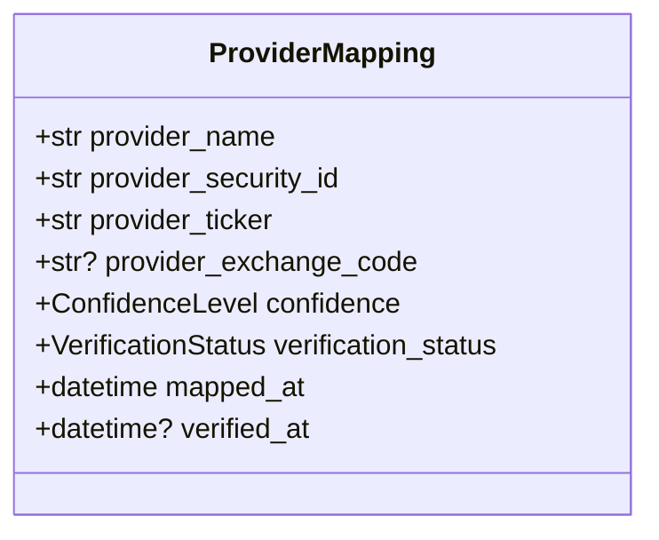
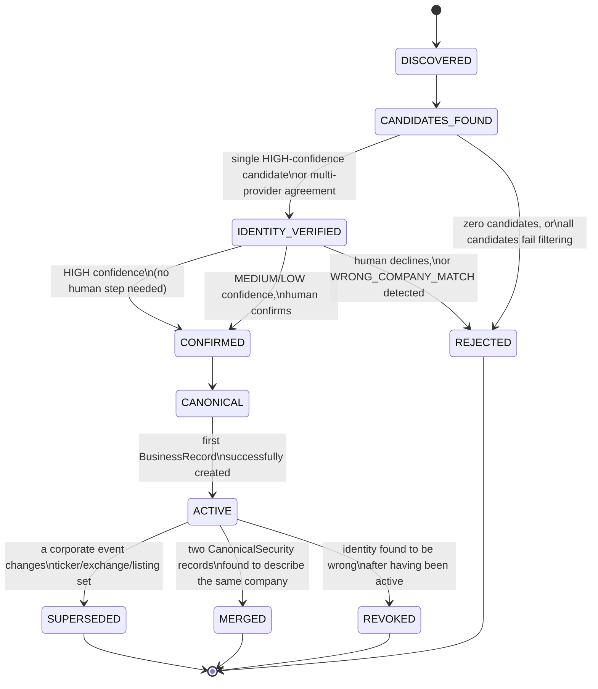

# Canonical Security Foundation — Implementation Design

**Sprint scope:** design only. Sprint K established the target
architecture (Discovery → Resolver/Verification → Confirmation →
Canonical Security → Provider Adapter → BusinessRecord → Analysis →
Investment Case → Recommendation). This document specifies the smallest
implementation of the `CanonicalSecurity` foundation precisely enough that
implementation can begin immediately afterward with minimal architectural
uncertainty. No code is written this sprint.

---

## Phase 1 — Baseline

- `git status`: clean except the same three pre-existing untracked local
  files present since before Sprint H.
- HEAD: `1693fa7` (Sprint K's commit) — confirmed present in `git log`.
- Provider baseline tests: `.venv/bin/python -m pytest tests/ -k "provider
  or business_data or sec_edgar or alpha_vantage"` → **405 passed, 2
  failed**, identical to Sprints H/I/J/K's baseline (the same two
  historical sprint-scoped guard tests asserting no `httpx` import exists
  in `atlas/business_data_providers/http.py` — pre-existing, unrelated to
  and unaffected by any of these five design/validation sprints; zero
  production code touched in any of them).
- No push performed.

---

## Phase 2 — Canonical Security Aggregate

**Aggregate root:** `CanonicalSecurity`, identified by a new, stable,
Atlas-internal `CanonicalSecurityId` (a UUID string, following the exact
pattern already used by `CaseId`/`DecisionId` in `atlas/core/domain/`).

**Ownership:** `CanonicalSecurity` owns the identity of one real-world
company — its name, its set of tradeable listings (native + ADR/GDR/OTC),
its known external identifiers, and the record of which provider
candidates were accepted or rejected in reaching that identity. It does
**not** own market data, financial statements, analysis results, or
recommendation state — those remain exactly where they are today
(`BusinessRecord`, `CanonicalAnalysis`, `RecommendationState`).

**Responsibilities (restated precisely for implementation):**
1. Hold the accepted identity fields (Phase 3).
2. Hold the set of `ListingRef`s (native/ADR/GDR/OTC relationships).
3. Hold the set of `ProviderMapping`s (Phase 5).
4. Enforce its own invariants (below) on every state transition.
5. Expose its current `ResolutionStatus` (Phase 6) so downstream code
   (`BusinessRecord` creation, Phase 9) can gate on it.

**Invariants** (must hold at every valid state, not just at creation):
- A `CanonicalSecurity` in `ResolutionStatus.CANONICAL` or `ACTIVE` must
  have at least one `ListingRef` with `relationship=NATIVE` or one with
  `relationship=ADR` — never zero listings.
- A `CanonicalSecurity` may never have two `ListingRef`s with the same
  `(exchange_mic, ticker)` pair — that would itself be an unresolved
  collision, not a valid canonical state.
- `CanonicalSecurityId` is immutable for the aggregate's entire lifetime,
  including across `SUPERSEDED`/`MERGED` transitions (Phase 6) — a
  superseded record keeps its own ID and points forward, it is never
  reassigned.
- A `CanonicalSecurity` may not transition to `CANONICAL` while any
  `ProviderMapping` on it is in `REJECTED` verification status without
  that mapping being excluded from the accepted set — rejected mappings
  are retained for audit (Sprint J Phase 11's provenance model) but never
  contribute to the aggregate's active identity.

**Lifecycle:** governed entirely by `ResolutionStatus` (Phase 6) — the
aggregate does not have a separate "lifecycle" concept distinct from that
state machine.

**What belongs inside the aggregate vs. elsewhere:**

| Belongs inside `CanonicalSecurity` | Belongs elsewhere |
|---|---|
| Identity fields (Phase 3) | Market prices, financial facts — `BusinessRecord` |
| `ListingRef`s | Analysis results — `CanonicalAnalysis` |
| `ProviderMapping`s | Recommendation state — `RecommendationState` |
| `ResolutionStatus` | The investor-facing Watchlist/Portfolio ticker fields (these *reference* a `CanonicalSecurityId` once resolved, per Phase 8, but are not owned by it) |
| Accepted/rejected candidate provenance | The Decision-scoped `security_confirmation`/`security_identity_evidence` tables (Sprint K: left unchanged, a separate, narrower-scoped mechanism) |

---

## Phase 3 — Aggregate State

| Field | Required / Optional / Derived | Immutable / Mutable |
|---|---|---|
| `canonical_security_id` | Required | Immutable |
| `canonical_company_name` | Required | Mutable (rare — legal renames) |
| `native_ticker` | Required | Mutable (rare — ticker changes) |
| `primary_exchange_mic` | Required | Mutable (rare) |
| `country` | Required | Mutable (rare) |
| `trading_currency` | Required | Mutable (rare) |
| `security_type` | Required | Immutable per listing (a `ListingRef`-level field, duplicated here only for the primary listing's convenience) |
| `primary_listing` | Derived (computed as whichever `ListingRef` has `relationship=NATIVE`, or the sole listing if only an ADR was ever resolved) | Mutable, as `listings` change |
| `provider_mappings` | Derived (the `ProviderMapping` collection, Phase 5) | Mutable — append-only in practice, entries never deleted, only superseded |
| `listings` | Derived (built from resolution evidence) | Mutable — append-only, never overwritten (Sprint J Phase 4, restated) |
| `identity_confidence` | Derived (Sprint J Phase 8's model, recomputed whenever a mapping is added/changed) | Mutable |
| `resolution_status` | Required | Mutable, governed by Phase 6's state machine |
| `created_at` | Required | Immutable |
| `updated_at` | Required | Mutable — bumped on every state change |

**Fields evaluated and explicitly excluded from the aggregate root**
(they live one level down, on `ListingRef` or `ProviderMapping` instead,
to avoid duplicating per-listing data at the aggregate level): per-listing
`exchange`, `MIC`, `currency`, and `security_type` beyond the primary
listing's convenience copies above; these are the authoritative fields on
each `ListingRef`, and the aggregate-level copies are always derived from
the primary listing, never independently settable.

---

## Phase 4 — Canonical Identifiers

| Identifier | Ownership |
|---|---|
| **`canonical_security_id`** | The one canonical identifier `CanonicalSecurity` itself defines and owns — Atlas-internal, never sourced from a provider |
| ISIN | Alternate identifier — recorded opportunistically when a provider supplies it (none did, live, through Sprint I); never required for `CANONICAL` status |
| FIGI | Alternate identifier — same treatment; Atlas's existing OpenFIGI adapter (Sprint K Phase 12: reused as-is) is the one concrete path to populating this |
| CUSIP / SEDOL | Alternate identifiers — same opportunistic treatment, lowest priority per Sprint J's hierarchy |
| CIK | Alternate identifier, **scoped**: valid only for SEC-registered filers, never treated as sufficient for a non-US company (Sprint J Phase 5, restated as an explicit implementation constraint — code must never fall back to "no CIK means not a real company") |
| Provider IDs (e.g., a provider's own internal symbol/instrument ID) | Alternate identifiers, scoped to that provider's own `ProviderMapping` entry — never elevated to cross-provider identity |
| Exchange symbol (ticker) | Alternate identifier — the least trustworthy, per Sprint J's hierarchy; recorded per-listing on `ListingRef`, never as a standalone cross-listing identity key |
| Internal Atlas ID | = `canonical_security_id` — same thing, listed separately in the brief only because it's easy to conflate with a provider ID; it is not |

**Historical identifiers**: when `native_ticker` or `primary_exchange_mic`
changes (a real corporate event, not a resolution correction), the
previous value is retained in an append-only `identifier_history` list
(new, small addition to the aggregate state — not itemized separately in
Phase 3's table since it is a derived audit trail, not a primary field),
so a `CanonicalSecurity`'s identity remains resolvable against old tickers
without ever pretending the change didn't happen.

---

## Phase 5 — Provider Mapping Model



| Field | Specification |
|---|---|
| `provider_name` | e.g. `"SEC_EDGAR"`, `"ALPHA_VANTAGE"`, `"TWELVE_DATA"`, `"OPENFIGI"` — a closed, extensible enum, not a free string, so a typo can never silently create a phantom provider |
| `provider_security_id` | The provider's own stable internal ID where one exists (SEC's CIK, Twelve Data's `mic_code`+`symbol` pair serialized, OpenFIGI's FIGI) |
| `provider_ticker` | The exact ticker string that provider resolved to this security — may differ from `native_ticker` (e.g., Twelve Data's `VOLV.B` vs. the investor's typed `VOLV-B`) |
| `provider_exchange_code` | The provider's own exchange label, kept distinct from the canonical `mic_code` on `ListingRef` since providers use inconsistent display strings (Twelve Data's `"OMX"` vs. the standardized `XSTO`) |
| `confidence` | Sprint J Phase 8's `HIGH`/`MEDIUM`/`LOW`/`REJECTED`, computed **per mapping**, not just at the aggregate level — a `CanonicalSecurity` can have one `HIGH`-confidence mapping (Twelve Data) and one `REJECTED` mapping (SEC EDGAR's collision) simultaneously, and both must be representable |
| `verification_status` | `UNVERIFIED` / `CORROBORATED` (another provider independently agrees) / `DISPUTED` (another provider disagrees) / `REJECTED` |
| `mapped_at` / `verified_at` | Timestamps for audit — `verified_at` is null until a second provider or OpenFIGI corroborates |

**Explicitly, per the brief's own list:** SEC EDGAR, Alpha Vantage, Twelve
Data, and OpenFIGI are all first-class `provider_name` values from day
one — OpenFIGI is not just "the confirmation adapter," it is itself a
provider mapping source in this model, matching how Sprint K's design
already treats the OpenFIGI adapter as a reusable verification primitive.
Future providers require only a new enum value and adapter, per Sprint K
Phase 16's provider-independence requirement.

---

## Phase 6 — Resolution Lifecycle



| State | Meaning |
|---|---|
| `DISCOVERED` | An investor input (or import row) has entered the system; no candidate search has run yet |
| `CANDIDATES_FOUND` | Provider candidate search (Sprint K Phase 6 steps 2-3) has returned at least one raw candidate |
| `IDENTITY_VERIFIED` | Sprint J's confidence scoring has run against the candidate set |
| `CONFIRMED` | Either automatically (single `HIGH`-confidence, no disagreement) or via explicit human confirmation (Sprint K's refactored confirmation step) |
| `CANONICAL` | The aggregate is fully formed and eligible to be referenced by a `BusinessRecord` — this is the state Phase 9's gate checks for |
| `ACTIVE` | At least one `BusinessRecord` has actually been created referencing this `CanonicalSecurity` — distinguishes "resolvable" from "actually in use," useful for migration/rollout observability (Phase 16) |
| `REJECTED` | Terminal — no `BusinessRecord` may ever reference this attempt; a fresh `DISCOVERED` attempt for the same input string starts a **new** aggregate, it does not retry this one |
| `SUPERSEDED` | Terminal for this record; a new `CanonicalSecurity` is created for the changed identity, linked via `identifier_history`/a forward pointer |
| `MERGED` | Terminal; used only when two independently-resolved aggregates are later found to be the same company — the losing record points to the winner, `BusinessRecord`s referencing the losing ID are **not** silently rewritten (see Phase 15) |
| `REVOKED` | Terminal; an `ACTIVE` security later found to have been wrongly resolved — existing `BusinessRecord`s referencing it are flagged, not deleted (Phase 15) |

**Valid transitions are exactly the arrows drawn above — no other
transition is valid**, including no direct `DISCOVERED → CANONICAL` skip
and no reverse transition out of any terminal state.

---

## Phase 7 — Resolution Session

**Atlas needs a temporary Resolution Session object — evaluated and
recommended as necessary, but explicitly lightweight.**

- **Lifetime**: the duration of one resolution attempt — from
  `DISCOVERED` through `CONFIRMED` or `REJECTED`. Not a long-lived entity;
  once terminal, its useful life is over except as an audit trail.
- **Ownership**: owned by whichever caller initiated resolution (Watchlist
  add, Portfolio import row, a future manual "add company" flow) — it is
  not a service-owned singleton.
- **Persistence**: yes, but minimally — a session's candidate list and
  scoring trail should be persisted (this *is* the audit record Sprint J's
  provenance model and Sprint K's failure-handling rules depend on), but
  it does not need its own rich query API; it is written once at each
  lifecycle transition and read only for audit/debugging.
- **Relationship to `CanonicalSecurity`**: a session either produces
  exactly one `CanonicalSecurity` (on reaching `CONFIRMED`→`CANONICAL`) or
  produces none (on `REJECTED`). A session is **not** a field on
  `CanonicalSecurity` itself — the aggregate does not need to know which
  session created it beyond a single `created_from_session_id` audit
  pointer.

**Why it's necessary, not skippable:** without it, the intermediate states
between "investor typed a ticker" and "canonical identity accepted"
(candidate generation, filtering, scoring) would have nowhere to live —
they would either be lost (no audit trail for *why* a resolution
succeeded or failed, undermining Sprint J's entire provenance design) or
would have to be crammed into `CanonicalSecurity` itself in a way that
violates Phase 2's invariant that a `CanonicalSecurity` only exists once
resolution has actually succeeded.

---

## Phase 8 — Integration Point

| Entry point | Precise insertion point |
|---|---|
| **Watchlist add** | Immediately after the existing non-blank/`.strip().upper()` validation in `AlphaWatchlistService.add_ticker` (`atlas/alpha/watchlist/service.py:70-89`) and **before** `CaseGenerationService.ensure_case_id` is ever called — resolution must complete (or be pending confirmation) before a Case is generated for this ticker |
| **Portfolio import** | Immediately after `AlphaHolding.__post_init__`'s existing normalization (`atlas/alpha/portfolio/models.py:80-89`) and before `import_portfolio` persists the holding — same principle, applied per-row for a bulk import |
| **Manual company add** | Any future explicit "add a company" flow enters at the same point as Watchlist add — there is currently no separate code path for this beyond Watchlist/Portfolio, so no additional insertion point is needed today |
| **Future API** | Any new caller (e.g., a future direct "resolve this ticker" endpoint) calls the same Resolver entry point directly — this is the one new, explicitly public seam this design adds, so future callers never need to duplicate Watchlist/Portfolio's own resolution-triggering logic |

**The precise rule**: resolution is triggered exactly once per distinct
raw ticker string, at first entry into the system, never re-triggered on
every subsequent read — a `CanonicalSecurity` in `CANONICAL`/`ACTIVE`
status for a given input is reused, not re-resolved, on every later
Watchlist/Portfolio reference to the same ticker.

---

## Phase 9 — BusinessRecord Contract

| Field | Today | Future |
|---|---|---|
| `ticker`/`company` | Sole identity key | Retained as a display/audit field only |
| `canonical_security_id` | Does not exist | **New, required field** — a `BusinessRecord` may only be constructed when this references a `CanonicalSecurity` in `CANONICAL` or `ACTIVE` status (Phase 6) |
| `provider_mapping_id` | Does not exist | New, optional field — which specific `ProviderMapping` produced this exact document, for full traceability from a fact back to the mapping that sourced it |
| `provider_provenance` | Document-level only | Extended per Sprint J Phase 11's `FieldProvenance` model — this sprint does not redesign that model, only confirms it attaches at this same contract boundary |
| `identity_confidence` | Does not exist | New, optional field — a snapshot of the `CanonicalSecurity`'s confidence *at the time this record was created*, since confidence can change later (a corroborating mapping added afterward) without needing to retroactively rewrite old records |

This is unchanged from Sprint K Phase 9's contract — this sprint adds no
new BusinessRecord fields beyond what Sprint K already specified; it
exists here only to confirm the contract is stable across both design
sprints, which matters for Phase 18's implementation ordering (this
contract can be implemented once, not twice).

---

## Phase 10 — Provider Adapter Contract

**Current:** `ticker: str → Provider.fetch(company_identifier=ticker) →
RawBusinessDocument`.

**Future:**
```
CanonicalSecurity.listings[i]  (a ListingRef)
    → select the ListingRef matching this provider's coverage
    → ProviderMapping.provider_ticker  (the provider-native symbol)
    → Provider.fetch(company_identifier=provider_mapping.provider_ticker)
    → RawBusinessDocument, tagged canonical_security_id + provider_mapping_id
```

**Interface changes required (not implemented this sprint):**
1. A new, additive capability on the provider Protocol family — a
   candidate-search method (e.g. `search_candidates(query: str) ->
   tuple[ProviderCandidate, ...]`), separate from `fetch()`. SEC EDGAR's
   version wraps its existing ticker→CIK resolution; a future Twelve Data
   adapter wraps `symbol_search`.
2. `fetch()`/`fetch_historical_snapshots()`/`fetch_company_profile()`
   continue accepting a `company_identifier: str` positional/keyword
   parameter **unchanged in type** — only the *caller* changes, from
   passing a raw investor-typed ticker to passing a resolved
   `ProviderMapping.provider_ticker`. This is a call-site change, not a
   Protocol signature change, minimizing the blast radius on existing
   provider implementations.
3. No change to the `BusinessDataProvider`/`HistoricalMarketDataProvider`/
   `CompanyProfileProvider` Protocol shapes themselves, and no change to
   `refresh_company_data`'s fan-out-and-collect-errors orchestration —
   both are preserved exactly, per Sprint J/K's own findings that this
   part of the architecture is already sound.

---

## Phase 11 — Persistence Design

| Table | Key columns | Notes |
|---|---|---|
| `canonical_securities` | `id` (PK), `canonical_company_name`, `native_ticker`, `primary_exchange_mic`, `country`, `trading_currency`, `security_type`, `resolution_status`, `created_at`, `updated_at` | One row per aggregate; no foreign key to anything, matching the codebase's established no-FK convention (confirmed in `security_confirmation`/`security_identity_evidence`/`decisions` tables) |
| `canonical_security_listings` | `id` (PK), `canonical_security_id` (indexed, not FK'd), `ticker`, `exchange_mic`, `currency`, `relationship` (`NATIVE`/`ADR`/`GDR`/`OTC`), `provider_symbol` | One row per `ListingRef`; append-only |
| `canonical_security_provider_mappings` | `id` (PK), `canonical_security_id` (indexed), `provider_name`, `provider_security_id`, `provider_ticker`, `provider_exchange_code`, `confidence`, `verification_status`, `mapped_at`, `verified_at` | One row per `ProviderMapping`; append-only, never updated in place — a changed mapping is a new row with the old one's `verification_status` set to `SUPERSEDED_MAPPING` (a mapping-level, not aggregate-level, status) |
| `canonical_security_identifiers` | `id` (PK), `canonical_security_id` (indexed), `identifier_type` (`ISIN`/`FIGI`/`CUSIP`/`SEDOL`/`CIK`), `value`, `recorded_at` | One row per alternate identifier (Phase 4); kept separate from the aggregate root table since most rows here will be null/absent for most securities, avoiding a wide, sparse `canonical_securities` table |
| `canonical_security_resolution_sessions` | `id` (PK), `initial_query`, `status`, `candidate_snapshot_json`, `scoring_snapshot_json`, `created_canonical_security_id` (nullable), `created_at`, `updated_at` | The Resolution Session (Phase 7) — one row per attempt, holding the audit trail |
| `canonical_security_resolution_events` | `id` (PK), `resolution_session_id` (indexed), `event_type`, `payload_json`, `recorded_at` | The domain event log (Phase 12) — append-only, ordered by `recorded_at` then `id`, matching the exact ordering-safety pattern already used in `security_confirmation`'s `_next_recorded_at` |

**Relationship tables**: `canonical_security_listings` and
`canonical_security_provider_mappings` already serve as the "relationship
tables" the brief asks about — native/ADR relationships are rows in the
former (distinguished by `relationship`), not a separate join table,
since every relationship is always to the same parent
`canonical_security_id`, never many-to-many.

No table in this design shares storage with `BusinessRecord`, `Case`,
`Decision`, or the existing `security_confirmation`/`security_identity_
evidence` tables — this is a wholly new, additive schema, consistent with
Sprint K Phase 12's "leave unchanged" disposition for the existing
identity tables.

---

## Phase 12 — Event Model

| Event | Payload |
|---|---|
| `SecurityDiscovered` | `resolution_session_id`, `initial_query`, `discovered_at` |
| `CandidateFound` | `resolution_session_id`, `provider_name`, `candidate_ticker`, `candidate_exchange_mic`, `candidate_country`, `candidate_name`, `candidate_security_type` |
| `CandidateAccepted` | `resolution_session_id`, `provider_name`, `candidate_ticker`, `confidence`, `reason` (which of Sprint J's acceptance rules were satisfied) |
| `CandidateRejected` | `resolution_session_id`, `provider_name`, `candidate_ticker`, `rejection_class` (one of Sprint J Phase 15's failure taxonomy values), `reason` |
| `SecurityConfirmed` | `resolution_session_id`, `confirmed_by` (`"automatic"` or an investor identifier), `confirmed_candidate_ticker`, `confirmed_at` |
| `SecurityRejectedByInvestor` | `resolution_session_id`, `rejected_candidate_ticker`, `rejected_at` — the explicit human-decline case from Sprint K Phase 15 |
| `ProviderMappingAdded` | `canonical_security_id`, `provider_name`, `provider_ticker`, `confidence`, `mapped_at` |
| `ProviderMappingUpdated` | `canonical_security_id`, `provider_name`, `old_verification_status`, `new_verification_status`, `updated_at` |
| `CanonicalSecurityCreated` | `canonical_security_id`, `resolution_session_id`, `canonical_company_name`, `native_ticker`, `created_at` |
| `CanonicalSecurityActivated` | `canonical_security_id`, `first_business_record_id`, `activated_at` |
| `SecurityMerged` | `losing_canonical_security_id`, `winning_canonical_security_id`, `merged_at`, `reason` |
| `SecuritySuperseded` | `old_canonical_security_id`, `new_canonical_security_id`, `superseded_at`, `reason` (e.g. `"ticker_change"`) |
| `SecurityRevoked` | `canonical_security_id`, `revoked_at`, `reason`, `affected_business_record_ids` |

Every event is a plain, frozen dataclass (matching the codebase's
established pattern in `security_confirmation`/`security_identity_
evidence`'s own event models), persisted append-only in
`canonical_security_resolution_events`, and never mutated after creation.

---

## Phase 13 — Existing Code Impact

| Module | Classification |
|---|---|
| `atlas/alpha/security_discovery/` | **UNCHANGED** (Sprint K Phase 12, restated) — reused as-is for candidate generation |
| `atlas/alpha/security_confirmation/` | **UNCHANGED** — continues to serve Decision-scoped confirmation independently; not touched by this implementation |
| `atlas/alpha/security_identity_evidence/` | **UNCHANGED** at the package level; its internal `_classify()` **pattern** is reimplemented (not imported) inside the new Resolver, since the existing service hard-depends on `decision_id` (Sprint K Phase 4's finding) — the *package itself* is not modified, a *new* module implements the equivalent logic against the new scope |
| `atlas/business_data_providers/sec_edgar.py` | **REFACTOR** — add the candidate-search capability (Phase 10); existing `fetch()` internals unchanged |
| `atlas/business_data_providers/alpha_vantage.py` | **REFACTOR** — same treatment |
| `atlas/analysis_engine/business_data/models.py` (`BusinessRecord`) | **REFACTOR** — additive fields only (Phase 9); no existing field removed or renamed |
| `atlas/alpha/business_data_refresh/` (repository, service, table) | **REFACTOR** — the gate (Phase 6/9) is enforced here, at record-creation time |
| `atlas/alpha/watchlist/` | **REFACTOR** — the integration point (Phase 8); existing validation logic preserved, resolution call added after it |
| `atlas/alpha/portfolio/` | **REFACTOR** — same treatment, per-row for imports |
| `atlas/alpha/investment_case/` | **UNCHANGED** — composition continues to work exactly as today; it inherits identity safety transitively via `BusinessRecord`'s new gate, needing no changes of its own |
| `atlas/core/domain/case/` (`Case`) | **UNCHANGED** — Sprint K's own finding, restated: Case's deliberate lack of identity remains correct |
| `atlas/core/domain/decision/` (Decision flow) | **UNCHANGED** — the existing Decision-scoped confirmation/evidence system continues operating exactly as it does today, as an optional second checkpoint (Sprint K Phase 14) |

**Nothing in this inventory is classified `REPLACE` or `REMOVE`** — every
existing module either stays as-is or is additively extended. This is a
direct consequence of Sprint K's own migration philosophy (every step
preserves Alpha functionality) carried through to the implementation
level.

---

## Phase 14 — Backward Compatibility

Unchanged in substance from Sprint K Phase 14, restated at the
implementation level:

- **Existing Cases**: no migration needed — `Case` never carried identity.
- **Existing Watchlists/Holdings**: **lazy** migration — a
  `canonical_security_id` is attached the first time an existing ticker
  is next touched by `refresh_company_data` after this feature ships, not
  via a bulk backfill job.
- **Existing BusinessRecords**: grandfathered — remain valid, queryable by
  their existing `company` string field. New records require
  `canonical_security_id`; old ones are distinguishable by its absence,
  and no code path ever treats "missing `canonical_security_id`" as an
  error for pre-existing rows.
- **Existing Decisions**: fully unaffected — no schema or behavior change
  to `atlas/core/domain/decision/` at all.
- **Migration mode: lazy + background**, explicitly not automatic-bulk and
  not purely manual — restated from Sprint K, because a bulk unattended
  resolution pass would reproduce exactly the risk (many tickers resolved
  with no chance to catch ambiguity) this entire foundation exists to
  prevent.

---

## Phase 15 — Failure Handling

| Failure | System behavior |
|---|---|
| Unknown ticker | Resolution session reaches `REJECTED` with `rejection_class=UNKNOWN_SECURITY`; investor sees "we couldn't find this security" |
| Unknown exchange (a provider candidate names an exchange Atlas has no MIC mapping for) | Candidate is retained in the session's audit trail but excluded from scoring — treated as a `LOW`-confidence signal at best, never silently dropped without a trace |
| Provider disagreement | Per Sprint J Phase 9 — automatic rejection of an unqualified (no-exchange) candidate against a qualified one; manual review on true multi-provider disagreement with no exchange-qualified basis to prefer one |
| Multiple candidates | `MULTIPLE_PLAUSIBLE_MATCHES` → routed to human confirmation (Phase 6, `IDENTITY_VERIFIED → CONFIRMED` via human path) |
| Provider timeout | Treated identically to that provider returning zero candidates for this attempt — does not block other providers' candidates from being scored; recorded in the session's audit trail as a distinct `provider_timeout` note, not silently conflated with "provider said no" |
| Provider unavailable (connection/HTTP error, matching `OpenFigiProviderUnavailable`'s existing precedent) | Same treatment as timeout — never treated as `UNKNOWN_SECURITY` on the strength of one provider's outage |
| Rejected identity (investor declines a proposed candidate) | `SecurityRejectedByInvestor` event recorded; session moves to `REJECTED`; a later attempt for the same raw ticker starts a **new** session rather than silently re-proposing the same rejected candidate (Sprint K Phase 15, restated precisely) |
| Identity revoked (an `ACTIVE` `CanonicalSecurity` later found wrong) | `SecurityRevoked` event; existing `BusinessRecord`s referencing it are **flagged** (a new `flagged_for_review` boolean, not deleted) so downstream Analysis/Case code can surface an honest "this company's identity was revoked, findings may be unreliable" state, following the same pattern the analysis engine already uses for `INSUFFICIENT_INPUT` |

---

## Phase 16 — Alpha Rollout Strategy

1. **Stage 1** — `CanonicalSecurity` aggregate, persistence (Phase 11),
   and the Resolver/Verification pipeline ship behind a feature flag,
   computing and logging resolutions for every new Watchlist/Portfolio
   entry **without gating anything** — pure shadow mode. Risk: none — no
   existing behavior changes.
2. **Stage 2** — Watchlist add begins **using** the resolution result: for
   `HIGH`-confidence resolutions, proceeds exactly as today (silent);
   for `MEDIUM`/`LOW`/ambiguous, surfaces the confirmation step. Risk:
   low — confined to the Watchlist add UX, easily reverted by flag.
3. **Stage 3** — Portfolio import adopts the same behavior, per-row.
   Risk: slightly higher (bulk imports surface more ambiguous cases at
   once), mitigated by Stage 1's shadow-mode data already having
   characterized how often that actually happens for Atlas's real
   universe.
4. **Stage 4** — `BusinessRecord` creation is gated on an accepted
   `CanonicalSecurity` (Phase 6/9) for **new** records only. Risk:
   moderate — this is the first stage that can actually block enrichment;
   staged last among the "new record" changes specifically so Stages 1-3
   have already de-risked the resolution logic itself using real traffic
   before anything depends on it succeeding.
5. **Stage 5** — Provider integration (Twelve Data or any future
   provider) is enabled, now landing directly into the gated pipeline
   from day one rather than needing its own separate identity safeguard
   retrofitted later — this is the stage Sprint K's "YES, WITH SAFEGUARDS"
   recommendation was written for.

**This order minimizes risk because** each stage only adds one new kind of
consequence: Stage 1 adds computation with zero consequence; Stage 2 adds
a UX interruption for the (per Sprint H/I) small ambiguous-ticker minority
only; Stage 3 extends that same interruption to a bulkier input path;
Stage 4 is the first stage with a hard blocking consequence, and by the
time it ships, Stages 1-3 have already proven the resolution logic against
real data; Stage 5 is the only stage that touches anything the rest of
this whole design program has been building toward, and it is
deliberately last.

---

## Phase 17 — Integration Test Design

| Test case | Validates |
|---|---|
| AAPL | Stage 2/4's silent `HIGH`-confidence path — zero friction |
| VOLV-B | Single-provider, `MEDIUM`-confidence, no confirmation required (no disagreement, only absence of a second provider) |
| MC | Core regression — `MULTIPLE_PLAUSIBLE_MATCHES`, mandatory confirmation, never auto-picks LVMH or Moelis & Co |
| EVO | Same, using Twelve Data's own ambiguous candidate list rather than a cross-provider conflict |
| TSM | `EXACT_ADR_MATCH` produces a `ListingRef` tagged `ADR`, never conflated with a hypothetical native TWSE listing |
| SAP | Identity resolves cleanly even though the statement stage separately fails (20-F gap) — asserts identity resolution and data completeness are tested as genuinely separate concerns |
| ASML | Same as SAP |
| SONY | Native listing resolves distinctly from any ADR route; asserts `ListingRef.relationship=NATIVE` |
| TM | Same ADR-distinctness assertion as TSM |
| ADR/native relationships | Synthetic case: two providers return a native listing and an ADR for the same company — asserts one `CanonicalSecurity` with two linked `ListingRef`s, never two separate aggregates and never one merged record |
| Provider disagreement | Synthetic three-provider disagreement, no exchange-qualified majority — asserts manual review, never auto-resolution by count |
| Rejected identity | Investor explicitly declines a proposed candidate — asserts no `BusinessRecord` created, `SecurityRejectedByInvestor` recorded, and a fresh attempt for the same ticker starts a **new** session rather than re-surfacing the same rejected candidate |
| Migration cases | An existing pre-migration `BusinessRecord` (no `canonical_security_id`) continues to be queryable exactly as before; a lazy-migration trigger (re-running `refresh_company_data` for an existing ticker) correctly attaches a `canonical_security_id` without disturbing the existing row's other fields |

Tests must exercise the full chain end-to-end (Discovery → Resolver →
Verification → Confirmation → CanonicalSecurity → Provider Adapter →
BusinessRecord), matching Sprint K Phase 17's own instruction that this
class of test does not exist anywhere in the codebase today.

---

## Phase 18 — Implementation Order

1. **`CanonicalSecurity` aggregate** (Phase 2/3) — pure domain code, zero
   dependents yet, safest possible starting point.
2. **Persistence** (Phase 11) — the tables, built and tested against the
   aggregate in isolation before anything else depends on them.
3. **Provider mappings** (Phase 5) — extends the aggregate with the
   collection every downstream piece needs.
4. **Resolution lifecycle + Resolution Session** (Phase 6/7) — the state
   machine and its audit trail; still nothing outside this new module
   depends on it yet.
5. **BusinessRecord contract** (Phase 9) — additive schema change; can be
   deployed with the new fields nullable/unused before anything writes to
   them, so it carries no behavioral risk on its own.
6. **Provider adapters** (Phase 10) — add candidate-search capability;
   existing `fetch()` call sites unchanged until step 7.
7. **Watchlist integration** (Phase 8, Stage 2) — the first point any of
   this actually affects investor-visible behavior, and only for the
   ambiguous minority.
8. **Portfolio integration** (Phase 8, Stage 3) — same shape, applied to
   the bulk-import path.
9. **Migration** (Phase 14) — the lazy-backfill trigger, wired in once
   steps 1-8 have already proven stable.
10. **Feature flag removal / Stage 4-5 promotion** (Phase 16) — the
    `BusinessRecord` gate goes live, and Twelve Data (or any future
    provider) integration is enabled directly against the now-proven
    pipeline.

**Why this order minimizes risk**: every step through 6 is purely additive
and inert — nothing existing changes behavior. Step 7 is the first
behavioral change, deliberately scoped to the smallest, most contained
surface (a single Watchlist add) before step 8 extends it to bulk import.
Steps 9-10 — the two steps with real migration/blocking consequences — are
sequenced last, after every piece of new logic has already been exercised
in production via steps 1-8's shadow/limited-blast-radius operation.

---

## Phase 19 — Architecture Validation

| Prior finding | Prevented by this implementation design? |
|---|---|
| Sprint H: SEC EDGAR silently resolves `MC`→Moelis, `EVO`→Evotec | **Yes** — Phase 9's gate means no `BusinessRecord` can be created from a `ProviderMapping` that never reached `CONFIRMED`/`CANONICAL`; SEC's flat, exchange-less match cannot reach `HIGH` confidence alone (Sprint J's hierarchy, unchanged) |
| Sprint H: Alpha Vantage's 25/day quota | **Out of scope, correctly** — an operational rate-limit issue, not an identity issue; unaffected by and unaffecting this design |
| Sprint I: Twelve Data's own candidate list includes Moelis & Co for `MC` | **Yes** — Phase 12's `CandidateRejected` event and Phase 6's `MULTIPLE_PLAUSIBLE_MATCHES` transition apply identically regardless of which provider produced the ambiguous list |
| Sprint I: latent currency-mixing risk (ADR vs. native statement) | **Structurally reduced, not fully closed** — the `ListingRef.relationship` distinction (Phase 3/11) prevents a native and ADR listing from silently sharing one identity record, which removes the primary vector; full per-fact currency-conflict detection (Sprint J Phase 14) remains a separate mechanism this design depends on but does not itself implement |
| Sprint J: no canonical identity model exists | **Yes** — this document is exactly that model, now specified to schema/event/persistence detail |
| Sprint J: the identity subsystem is disconnected from the live pipeline | **Yes** — Phase 8's integration point and Phase 18's implementation order are the concrete closing of this gap |
| Sprint K: `security_confirmation`/`security_identity_evidence` are `decision_id`-scoped and cannot gate BusinessRecord | **Yes, by design** — this sprint deliberately does not reuse those packages' storage or API surface for the new gate; it reimplements their *pattern* (Phase 13: the existing packages are `UNCHANGED`, a new module carries the equivalent logic at the correct scope) |

**Remaining, explicitly undocumented-as-solved:** full FX/currency-conflict
enforcement (Sprint J Phase 14) and identity re-verification-on-expiry
(Sprint J's `last_confirmed_at` field exists in the schema, Phase 3, but
no policy for *when* to re-verify is specified by this sprint) are both
carried forward as open items for a future sprint, not silently assumed
solved by this design.

---

## Phase 20 — Final Recommendation

**READY.**

Supporting evidence:

- Sprint J established that the domain model (`CanonicalSecurity`,
  identifier hierarchy, acceptance rules) is fully specified — this
  sprint has not needed to revise any of Sprint J's core design decisions,
  only to add implementation-level precision (concrete field
  classifications, table schemas, event payloads).
- Sprint K established exactly where the new logic must sit relative to
  the existing pipeline and existing identity packages, including the
  critical `decision_id`-scope-mismatch finding — this sprint's Phase 8/13
  directly operationalize that finding without discovering any new
  architectural obstacle in the process.
- This sprint's own Phase 18 implementation order was derivable directly
  and without ambiguity from Sprints J and K's prior conclusions — the
  absence of any newly-discovered blocking unknown while producing this
  level of detail is itself evidence the design is sound enough to build
  from.
- The one open item (Phase 19's remaining currency/re-verification gaps)
  is explicitly scoped as **future work beyond this foundation**, not as
  a defect in this foundation's own completeness — the foundation does not
  claim to solve those, and correctly does not need to in order to be
  buildable.

---

## Final Deliverables Index

1. This document — `docs/canonical_security_foundation_implementation_design.md`.
2. `CanonicalSecurity` aggregate specification — Phase 2.
3. Aggregate state definition — Phase 3.
4. Identifier ownership model — Phase 4.
5. Provider mapping model — Phase 5.
6. Resolution lifecycle — Phase 6.
7. BusinessRecord contract — Phase 9.
8. Provider adapter contract — Phase 10.
9. Persistence model — Phase 11.
10. Event model — Phase 12.
11. Module impact assessment — Phase 13.
12. Migration strategy — Phase 14.
13. Rollout strategy — Phase 16.
14. Integration test design — Phase 17.
15. Implementation sequence — Phase 18.
16. Final recommendation — Phase 20: **READY**.
17. Commit hash: recorded in this sprint's commit message (see repository
    history).
