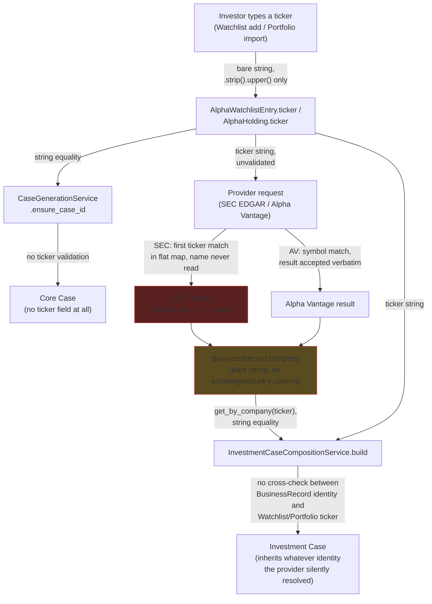
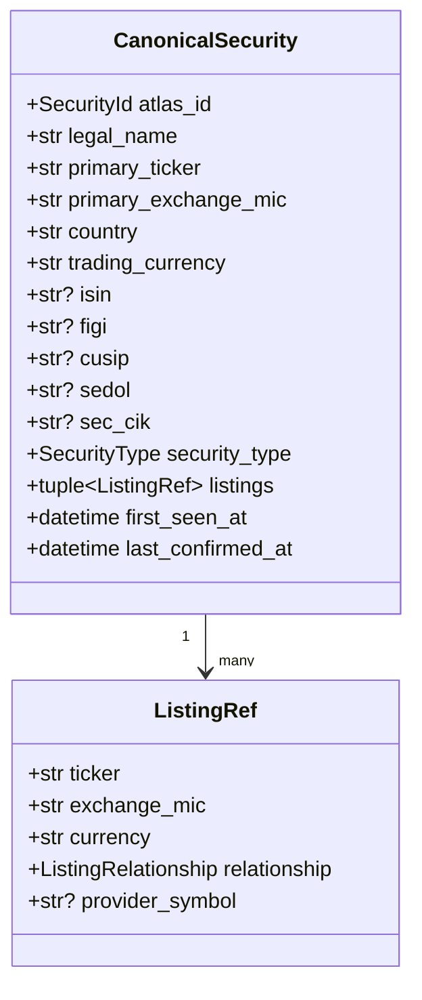
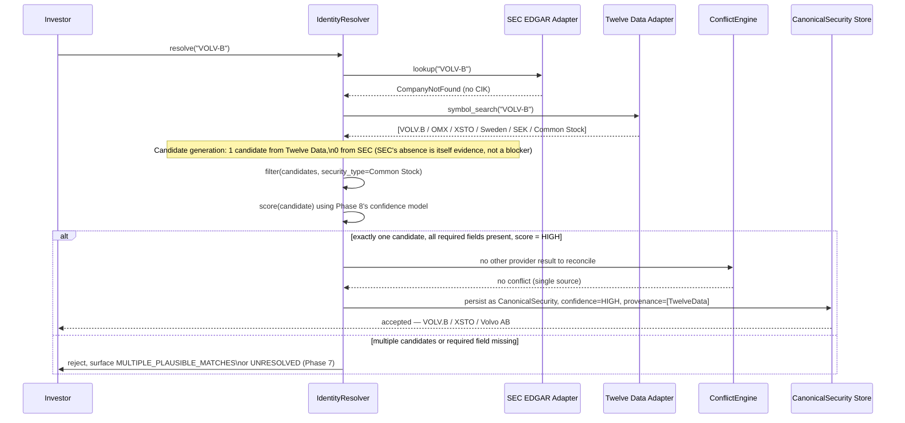
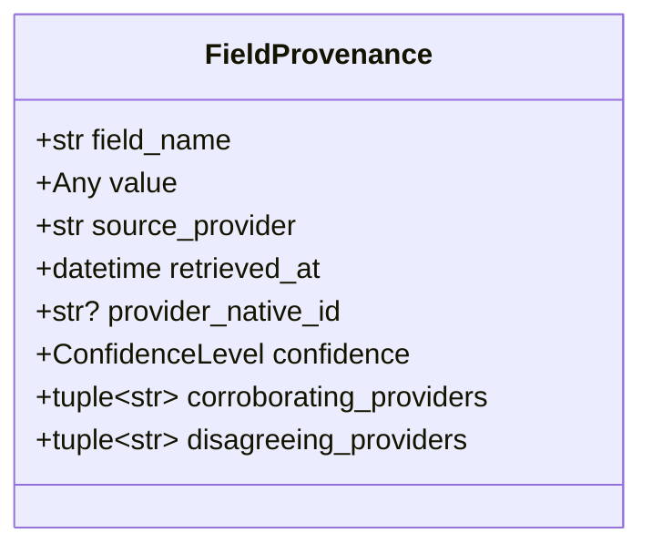
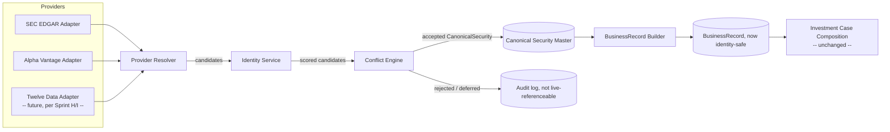

# Canonical Security Identity & Provider Safety — Design

**Sprint scope:** design only, per explicit instruction. No provider
integration, no UI work, no implementation. This document exists because
Sprint H and Sprint I proved with live evidence — not speculation — that
ticker symbols alone are not safe identifiers: SEC EDGAR silently resolves
`MC` to Moelis & Company (not LVMH) and `EVO` to Evotec SE (not Evolution
AB); Twelve Data's own `symbol_search` returns Moelis & Company as a
candidate for `MC` alongside the correct LVMH match, and two unrelated
companies alongside the correct Evolution AB match for `EVO`. This document
designs the model that must exist before any provider — including one
already in the codebase — is trusted to write canonical company data.

---

## Phase 1 — Baseline

- `git status`: clean except the three pre-existing untracked local files
  present since before Sprint H (`.env`,
  `atlas/business_data_providers/alpha_vantage.py.save`,
  `docs/atlas_beta_sprint1_figma_implementation_review.md`).
- HEAD: `418e67c` (Sprint I's commit) — confirmed present in `git log`.
- API keys: `.env` remains untracked; nothing from it is read, quoted, or
  needed by this sprint (pure design work).
- Baseline tests: `.venv/bin/python -m pytest tests/ -k "provider or
  business_data or sec_edgar or alpha_vantage"` → **405 passed, 2 failed**,
  identical to Sprint H and Sprint I's baseline (`test_no_provider_imports_
  added` in two historical sprint-scoped guard tests asserting
  `atlas/business_data_providers/http.py` has no `httpx` import — it does,
  unchanged since before this session; confirmed pre-existing and
  unaffected by any Sprint H/I/J action, since zero production code has
  been touched across all three sprints).
- No push performed.

---

## Phase 2 — Review of the Existing Identity Flow

Traced against the actual current source (file paths and line numbers
below refer to the code as it exists today).

### What identity exists at each step, today

| Step | Identity carried | Validation performed |
|---|---|---|
| **User input** — Watchlist add (`atlas/alpha/watchlist/api/schemas.py:14-16`, `service.py:70-89`) | A bare `ticker: str`, no exchange/country field on the request shape at all | Non-blank check, then `.strip().upper()` — nothing else |
| **User input** — Portfolio import (`atlas/alpha/portfolio/service.py:71-76`, `models.py:80-89`) | Same — `ticker: str` only | Identical: non-blank + `.strip().upper()` |
| **Case creation** (`atlas/core/domain/case/entity.py:29-38`) | **None.** `Case` is `{id, recorded_at}` — no ticker field exists in Core at all, by design (its own docstring: *"Case captures no investor-supplied content at all"*) | N/A — nothing to validate |
| **Provider request** — SEC EDGAR (`atlas/business_data_providers/sec_edgar.py:318-339`) | Ticker string only; SEC's own `title` field (the company name, present in the same source JSON) is read from the payload but **never extracted or compared** | First ticker-string match against SEC's flat map wins unconditionally — no name/exchange/country cross-check |
| **Provider request** — Alpha Vantage (`atlas/business_data_providers/alpha_vantage.py:381,447,512`) | Ticker string sent as `symbol=`; whatever `Name`/`Exchange`/`Country` the provider returns is accepted verbatim into `CompanyProfile` metadata | Only a currency-format guard (`_confirmed_currency_metadata`) — no identity cross-check anywhere in this file |
| **BusinessRecord persistence** (`atlas/analysis_engine/business_data/models.py:117-151`, `table.py:25-47`) | `company: str` — a bare, unvalidated, plain-`String` column with no `exchange`/`country`/`ISIN` column anywhere in the schema | Only `MISSING_COMPANY` (non-blank) in `validation.py:61-88`; any richer identity data that does exist (from Alpha Vantage's OVERVIEW) lives only in an untyped JSON metadata blob, never in a queryable column |
| **Investment Case composition** (`atlas/alpha/investment_case/service.py:216-286`) | The ticker stored on the matching `AlphaHolding`/`AlphaWatchlistEntry`, joined to `BusinessRecord.company` by plain string equality | **No check anywhere** that this ticker matches the identity a provider actually resolved (e.g., no comparison against `CompanyProfile.name`/`.exchange`/`.country`, extracted at `company_profile.py:51-78`, against the ticker used to fetch it) |

### Where ambiguity can enter

Three independent, unreconciled string-equality joins chain the whole
system together: `Watchlist.ticker == Portfolio.ticker == BusinessRecord
.company`. Ambiguity can enter at **every arrow** in the diagram below —
not just at the provider boundary, since even a correct provider result
is never checked against what the investor actually meant before it
becomes canonical.

### Identity flow diagram



**The critical structural finding, unchanged from Sprint H/I and now
precisely located:** Atlas has **two entirely disconnected identity
worlds**. (1) The live path above, which treats a bare uppercased ticker
string as sufficient identity everywhere, with zero cross-checking. (2) A
Decision-scoped feasibility seam — `atlas/alpha/security_discovery/`
(free-text name → candidate list, Sprint 19), `security_confirmation/`
(investor asserts a ticker for one `decision_id`, Sprint 20/22), and
`security_identity_evidence/` (a real OpenFIGI cross-check against the
confirmed ticker, classifying `verified`/`not_verified`/`ambiguous`/
`provider_unavailable`/`unsupported`, Sprint 23/24) — that has genuine
canonical-name matching and independent-provider verification, but is
**never invoked by, and carries no linkage to, the Watchlist → Portfolio →
BusinessRecord → Case path at all.** No file in `watchlist/`, `portfolio/`,
`case_generation/`, `business_data_refresh/`, or `investment_case/` imports
anything from these three packages. This is the single most important
existing asset for this sprint's design: **the hard part (a working,
tested, independent-provider identity verifier) already exists — it is
disconnected from the operational path, not absent from the codebase.**

---

## Phase 3 — Current Identity Inventory

| Identifier | Source | Globally unique? | Stable? | Lifetime | Atlas trusts it today? |
|---|---|---|---|---|---|
| Ticker (bare) | User input / provider symbol | **No** — reused across exchanges and, per Sprint H/I, even within one provider's own candidate list (`MC`, `EVO`) | No — companies change tickers on corporate actions | Indefinite as stored, but not point-in-time versioned | **Yes, fully** — it is the sole key on the entire live path |
| Exchange / MIC code | Only present in Twelve Data's `symbol_search` response (`mic_code`, `exchange`); absent from SEC EDGAR entirely | Yes, in combination with ticker | Yes | N/A | **No** — never stored on `BusinessRecord`, never used as a lookup key |
| Country | Twelve Data (`symbol_search`), Alpha Vantage (`OVERVIEW.Country`) | No (many companies per country) | Yes | N/A | **No** — same as exchange, JSON-blob-only where present at all |
| Company legal name | SEC (`title`, never read), Alpha Vantage (`Name`, stored but never compared), Twelve Data (`instrument_name`) | No | Mostly, with legal-entity renames as an exception | N/A | **No** — read into metadata but never used as a check |
| Currency | Alpha Vantage (`OVERVIEW.Currency`), Twelve Data (`symbol_search.currency`) | N/A | Mostly stable | N/A | Partially — used as a display/safety field (ATLAS-032/033's `CompanyProfile.currency`), not as identity |
| CIK | SEC EDGAR only, derived from ticker lookup | Yes, but **only for SEC-registered US filers** | Yes, permanent | N/A | Implicitly, within SEC EDGAR's own resolution, but never surfaced as a first-class Atlas field |
| ISIN | Not obtainable on any provider tier live-tested through Sprint I (Twelve Data gates it behind a paid "Data add-on") | Yes, globally, by design | Yes | N/A | **No** — not present anywhere in the codebase today |
| FIGI | Same as ISIN; Twelve Data gates it behind Ultra/Enterprise tier; **`atlas/alpha/security_identity_evidence/`'s OpenFIGI integration is the one place Atlas already calls a FIGI-aware API**, but only for the Decision-scoped verification seam, never for BusinessRecord identity | Yes, granular (share-class level) | Yes | N/A | **No**, on the live path; **yes**, in the disconnected verification seam |
| CUSIP / SEDOL | Not obtainable on any provider tier tested | Regional (US/UK-centric) | Yes | N/A | No |
| Provider-specific IDs (e.g., Alpha Vantage's own internal symbol matching, Twelve Data's `symbol`+`mic_code` pair) | Each provider's own response | Only within that provider's namespace | Provider-dependent | N/A | No — discarded after the single request that used them |
| `provider_id` (on `BusinessRecord`) | Atlas's own field (`models.py:117-151`) | Identifies *which provider*, not *which company* | Stable | N/A | Yes, but this is provenance, not identity |

---

## Phase 4 — Canonical Security Identity



| Field | Required / Optional / Derived | Immutable / Mutable | Rationale |
|---|---|---|---|
| `atlas_id` | Required | Immutable | Atlas's own primary key — the one thing that must never change once assigned, exactly as `CaseId`/`DecisionId` already work elsewhere in Core |
| `legal_name` | Required | Mutable (rare — legal renames happen) | The strongest human-checkable corroborating signal; both live collisions (Phase 12) would have been caught by a name check |
| `primary_ticker` | Required | Mutable | Companies change tickers; must be versioned, not treated as permanent |
| `primary_exchange_mic` | Required | Mutable (rare — delistings/re-listings) | Directly closes the Sprint H/I collision gap: neither SEC EDGAR nor a naive Twelve Data lookup enforces this today |
| `country` | Required | Mutable (rare) | Corroborating signal, redundant with exchange in most cases but catches cross-border exchange groups (e.g., Euronext) |
| `trading_currency` | Required | Mutable (rare) | Feeds Phase 14's currency-safety rules directly |
| `isin` | Optional | Immutable once set | Not obtainable on any live-tested provider tier as of Sprint I — field exists so it can be adopted opportunistically, never blocks acceptance today |
| `figi` | Optional | Immutable once set | Same as ISIN; Atlas already has a working FIGI integration in `security_identity_evidence/openfigi_adapter.py` — this field is where its output should land once wired into the live path |
| `cusip` / `sedol` | Optional | Immutable once set | Same treatment as ISIN — regional, not currently obtainable, opportunistic only |
| `sec_cik` | Optional (present only for SEC-registered filers) | Immutable once set | Not a universal identifier — must never be treated as sufficient for non-US companies (this was never actually attempted anywhere in the codebase, but is worth stating explicitly as a rule given SEC EDGAR is Atlas's most mature provider) |
| `security_type` | Required | Immutable per listing | Distinguishes Common Stock from ETF/Depositary Receipt sharing a ticker — the exact confusion seen live in `EVO`'s Australian/Canadian false candidates (Sprint I, Phase 4) |
| `listings` | Derived (built from resolution evidence) | Mutable — append-only, never overwritten | Holds one or more `ListingRef` entries — this is what makes native-vs-ADR (Phase 10) a first-class relationship instead of a second, unrelated security |
| `first_seen_at` / `last_confirmed_at` | Derived | `first_seen_at` immutable, `last_confirmed_at` updates on each successful re-resolution | Provenance/audit trail, not identity itself |

Not implemented this sprint — specification only.

---

## Phase 5 — Identifier Hierarchy

Ranked by trustworthiness, grounded in what Sprints H/I actually observed
(not by abstract identifier theory):

1. **ISIN** — would outrank everything if available; globally unique by
   construction, exchange-independent. **Not currently obtainable on any
   live-tested provider tier** — ranked first in principle, but cannot be
   Atlas's *primary* mechanism today because it is never populated.
2. **FIGI** — same status as ISIN for the live provider path, but Atlas
   already has a working consumer of it in the disconnected
   `security_identity_evidence` seam (Phase 2) — this is the identifier
   Atlas is closest to actually having, once that seam is wired in.
3. **Exchange/MIC + ticker, as a pair** — the highest-ranked identifier
   Atlas can obtain *today*, from Twelve Data's `symbol_search`. This pair
   is what would have prevented both live collisions: SEC's flat ticker
   map has no MIC to disambiguate with, and a MIC-qualified search
   (`MC` on `XPAR`) never returns Moelis & Company at all.
4. **Legal company name** (canonicalized, per the existing
   `canonicalize_company_text` function) — a strong secondary check, not a
   primary key, since formatting varies ("LVMH Moët Hennessy Louis Vuitton
   SE" vs. "LVMH") in ways exchange/MIC does not.
5. **CIK** — ranks below exchange/MIC specifically because **it can never
   identify a non-US company** by construction (SEC's own registry scope);
   it is a strong identifier only within its own narrow domain.
6. **Country** — a weak, redundant-with-exchange corroborating signal,
   never sufficient alone (many companies share a country).
7. **Currency** — weakest identity signal (many companies share a
   currency); useful only for Phase 14's safety checks, never for
   resolving identity.
8. **Ticker alone** — never sufficient, ranked last. Confirmed unsafe live,
   twice, on two independent providers.

**Direct answers to the brief's example questions:**
- *Should ISIN outrank ticker?* Yes, in principle — but it is not
  currently available, so this is a design-time ranking, not an
  operational one yet.
- *Should MIC outrank exchange name?* Yes — MIC is a standardized code;
  exchange *name* strings vary by provider (Twelve Data returns `"OMX"` for
  Stockholm, a display label, while `mic_code: "XSTO"` is the standardized
  form) and should never be compared as free text.
- *Should FIGI outrank provider IDs?* Yes — FIGI is provider-independent by
  design; a provider's own internal symbol ID is meaningful only within
  that provider's namespace and should never be trusted across providers.
- *Can CIK identify non-US companies?* No — this must be an explicit,
  written rule, not an assumption, since SEC's registry is US-filer-scoped
  by construction.
- *Should ticker ever be accepted alone?* No, under any circumstance —
  this is Phase 16's first acceptance rule, restated here because it is the
  hierarchy's own conclusion, not a separate decision.

---

## Phase 6 — Identity Resolution Pipeline

Traced concretely for the brief's own example: an investor types `VOLV-B`.



**Steps in prose, matching the diagram:**

1. **Provider lookup** — query every configured provider independently
   (unchanged from the existing `refresh_company_data` fan-out pattern —
   this sprint does not propose changing that orchestration shape).
2. **Candidate generation** — collect every distinct `(ticker, exchange_mic,
   country, security_type, legal_name)` tuple any provider returns. A
   provider returning zero candidates (SEC EDGAR for `VOLV-B`) is not an
   error at this stage — it is simply an empty contribution to the
   candidate pool.
3. **Filtering** — discard candidates whose `security_type` doesn't match
   what was requested (e.g., drop the ETF/Depositary-Receipt candidates
   Twelve Data returned for `EVO`, per Sprint I's live evidence).
4. **Scoring** — apply Phase 8's confidence model to every surviving
   candidate.
5. **Acceptance** — exactly one candidate at `HIGH` confidence with no
   unresolved conflict → accept, persist, done.
6. **Rejection** — zero candidates, or more than one candidate that cannot
   be disambiguated by Phase 8's scoring → reject with a specific Phase 7
   classification, never a silent default.
7. **Persistence** — an accepted `CanonicalSecurity` is what a
   `BusinessRecord` should reference (Phase 16's central rule), not a bare
   ticker string.

---

## Phase 7 — Candidate Classification

| Class | Acceptance criteria |
|---|---|
| `EXACT_NATIVE_MATCH` | Exactly one candidate remains after filtering; its `security_type` is a native equity listing (not a depositary receipt); country/exchange agree with the requesting context (or no context was specified and this is the only candidate) |
| `EXACT_ADR_MATCH` | Exactly one candidate remains; its `security_type` is explicitly a Depositary Receipt / ADR, on a US exchange, for a company whose primary listing is elsewhere — must be tagged distinctly from `EXACT_NATIVE_MATCH`, never silently treated the same way (this is precisely what Twelve Data did for `TSM`/`TM` in Sprint I) |
| `ALTERNATIVE_TICKER_REQUIRED` | Zero candidates for the ticker as given, but a documented alternate spelling (e.g., `NOVO-B` → `NVO`, confirmed live in Sprint H) produces exactly one high-confidence candidate |
| `MULTIPLE_PLAUSIBLE_MATCHES` | More than one candidate survives filtering and cannot be reduced to one by exchange/country/name agreement — the live, confirmed state of both `MC` and `EVO` against Twelve Data's own candidate list |
| `WRONG_COMPANY_MATCH` | A single candidate is returned, but its `legal_name`/`country`/`exchange` **disagree** with independently known facts about the requested company (e.g., SEC's `MC` → Moelis & Co, when the requesting context — a portfolio holding tagged "LVMH" — disagrees) — this class requires *some* independent corroborating signal to detect, which is exactly why Phase 9's provider-agreement rules matter |
| `UNRESOLVED` | Zero candidates from any provider, and no alternate ticker spelling resolves one either |

---

## Phase 8 — Identity Confidence

| Level | Criteria |
|---|---|
| `HIGH` | Exactly one candidate; exchange/MIC present and matches expected context (if any); country agrees; security type is the expected kind; legal name canonicalizes to a plausible match; **and**, where more than one provider was queried, all providers that returned a candidate agree |
| `MEDIUM` | Exactly one candidate, but one non-critical field is missing (e.g., no MIC available, only a display exchange name) or only one provider could be queried at all (e.g., SEC EDGAR alone, with no second provider to corroborate) |
| `LOW` | A candidate exists but disagreement or missing critical fields (no exchange, no country) prevent full corroboration — the resolver may still resolve, but flags the case for a lighter-weight review, not automatic downstream trust |
| `REJECTED` | `MULTIPLE_PLAUSIBLE_MATCHES` that cannot be disambiguated, `WRONG_COMPANY_MATCH` detected via disagreement, or `UNRESOLVED` |

**Explicitly, per the brief's own requirement: confidence must never be
computed from ticker equality alone.** The scoring inputs are, in order of
weight: exchange/MIC agreement (heaviest), country agreement, security-type
agreement, canonicalized legal-name agreement, and — only as a
confidence-*raising*, never confidence-*establishing*, signal — whether
multiple independent providers agree. A ticker match with **no** other
agreeing field is `LOW` at best, never `HIGH`, regardless of how many
providers happen to return the same ticker string.

---

## Phase 9 — Provider Agreement

| Scenario | Rule |
|---|---|
| SEC and Twelve Data agree (same company, by name/exchange/country) | Automatic acceptance at `HIGH` confidence |
| SEC and Twelve Data disagree (the live `MC`/`EVO` case) | **Automatic rejection of the disagreeing candidate that lacks exchange/MIC support** — SEC EDGAR's flat ticker map carries no exchange field, so in any disagreement against an exchange-qualified source, **prefer the exchange-qualified result and discard SEC's**, but retain SEC's rejected answer in provenance for audit (Phase 11), never silently drop it from the record entirely |
| Three (or more) providers disagree with no majority | Manual review required — do not resolve automatically under any voting or majority rule, since Sprint H/I never established that "more providers agreeing" is itself evidence of correctness (a systematic error shared by data vendors sourcing from the same upstream feed is plausible and unfalsifiable by count alone) |
| One provider returns an ADR, another returns a native listing | **Not a disagreement to resolve — both are correct, for different securities** (Phase 10). Both should be recorded as separate `ListingRef` entries under the same `CanonicalSecurity`, never merged into one and never treated as a conflict requiring rejection |
| Only one provider has any candidate at all (e.g., SEC has zero for a Nordic name) | Not an automatic rejection — a single-provider `HIGH`-eligible candidate should still resolve, at `MEDIUM` confidence per Phase 8, since corroboration was never possible, not because it failed |

**Deferred ingestion**: any `LOW`-confidence or `MULTIPLE_PLAUSIBLE_MATCHES`
result should be persisted as a *pending* resolution (visible for audit,
not silently discarded) but must **not** be promoted to a `CanonicalSecurity`
that a `BusinessRecord` can reference until a human or a stronger signal
(e.g., ISIN becoming available) resolves it — this is the deferred-
ingestion outcome the brief asks for.

---

## Phase 10 — Native Listing vs. ADR/GDR/OTC

**Design decision: linked, never interchangeable, and native/ADR/GDR/OTC
listings should never collapse into a single security record.**

Reasoning, grounded in this sprint's own evidence:
- They have **different currencies** (Phase 14) — Volvo AB's native listing
  trades in SEK, an ADR would trade in USD; combining their price series
  without conversion is exactly the kind of currency-mixing risk Sprint I's
  Phase 12 flagged as latent (TSM/TM's ADR quote vs. a hypothetical native
  Taiwan/Japan statement).
- They have **different trading calendars and corporate-action mechanics**
  (ADR ratios can change independently of the underlying).
- **Twelve Data itself already distinguishes them** (`instrument_type:
  "American Depositary Receipt"` vs. `"Common Stock"`, confirmed live for
  TSM/TM in Sprint H) — Atlas should preserve, not discard, a distinction
  the provider itself already makes explicit.

**Modeled as:** one `CanonicalSecurity` per real-world company, with a
`listings: tuple[ListingRef]` field (Phase 4) holding one `ListingRef` per
actual tradeable instrument — native listing, ADR, GDR, or OTC line —
each carrying its own ticker/exchange/currency and a `relationship` tag
(`NATIVE`, `ADR`, `GDR`, `OTC`). Any consumer (market data fetch, statement
fetch) must specify *which* `ListingRef` it wants, or explicitly accept
"the company's primary listing" as a documented default — never an
implicit, unstated choice the way today's code makes it (Phase 2).

---

## Phase 11 — Provider Provenance

Every field on a `BusinessRecord` (and, going forward, every field on a
`CanonicalSecurity`) should carry:



Worked example, matching the brief's own:

```
Revenue
  value: 416,161,000,000
  source_provider: "SEC_EDGAR"
  retrieved_at: 2026-08-15T00:00:00Z
  provider_native_id: "CIK0000320193"
  confidence: HIGH
  corroborating_providers: ()
  disagreeing_providers: ()
```

This is additive to the existing `Provenance`/`ValidationStatus` fields
already on `BusinessRecord` (`models.py:117-151`) — it does not replace
them, it extends per-field granularity where today only per-*document*
provenance exists. The `confidence`/`corroborating_providers`/
`disagreeing_providers` triplet is what makes Phase 9's agreement rules
auditable after the fact, not just enforced at resolution time.

---

## Phase 12 — Identity Collision Rules

Analyzed directly from the two live cases:

**`MC`:**
- SEC EDGAR: single flat-map match → Moelis & Co. No exchange field exists
  to disagree with. **Root cause: the ticker map has no disambiguating
  dimension at all** — it is not that SEC "chose wrong," it structurally
  cannot choose right.
- Twelve Data: `symbol_search` returns LVMH (Euronext Paris, XPAR) ranked
  first, **and** Moelis & Co (NYSE, XNYS) in the same response. **Root
  cause: ticker collision across exchanges is real and even a rich,
  exchange-aware provider surfaces it rather than hiding it** — the risk
  moves from "invisible" (SEC) to "visible but requires a check" (Twelve
  Data).

**`EVO`:**
- SEC EDGAR: single flat-map match → Evotec SE. Same structural root cause
  as `MC`.
- Twelve Data: returns Evolution AB (Sweden, XSTO) ranked first, alongside
  Embark Early Education Limited (ASX) and Evovest Global Equity ETF
  (TSX). **Notably, Evotec SE does not appear in Twelve Data's own EVO
  candidate list at all** — the two providers' failure modes are
  independent, not overlapping, which is itself useful: a resolver that
  requires provider agreement (Phase 9) would never accept SEC's Evotec SE
  match once Twelve Data's Evolution AB candidate is filtered in by
  exchange/country and SEC's is filtered out for lacking any exchange field
  to support it.

**Generic collision handling, and the explicit rejection rules the brief
requires:**

1. **Atlas must never silently accept the first result returned by any
   provider.** Both collisions are literally "the first (and only) result
   SEC returns," proving this rule is not theoretical.
2. **Atlas must never silently accept a ticker match as sufficient**,
   regardless of how confident the returning provider's API appears
   (Twelve Data's HTTP 200 for `MC` carries a correct answer *and* a wrong
   one in the same payload — status code success is not identity success).
3. **Atlas must never silently prefer "whichever provider is configured
   first" or "whichever provider is cheaper/faster to call.**" Preference
   must be driven by which candidate has exchange/MIC + country + name
   support (Phase 5's hierarchy), not by provider configuration order.
4. **A ticker known to collide (seeded initially from this sprint's two
   confirmed cases, `MC` and `EVO`) should be flagged for mandatory
   multi-field agreement even when only one provider is configured** —
   this is the one place a small, explicit block/watch-list is justified as
   an interim measure ahead of the full resolver (see Phase 19, step 3).

---

## Phase 13 — Cross-Provider Merge Rules

| Scenario | Rule |
|---|---|
| Two providers return identical ISIN | **Merge** — ISIN agreement is the strongest possible corroboration once ISIN is actually available (not true for any provider tier tested through Sprint I, but the rule should exist for when it is) |
| Same ticker, different exchange | **Reject the merge** — these may be genuinely different securities (dual-listed companies, or an outright collision); require exchange-level agreement before merging any fields |
| Same company, different ADR vs. native listing | **Do not merge as one security — link as related `ListingRef` entries under one `CanonicalSecurity`** (Phase 10), never combine their price/statement data into a single record |
| Different currencies reported for what claims to be the same security | **Reject the merge, flag for review** — this is a `CURRENCY_CONFLICT` (Phase 15), and per Phase 14, currency disagreement is itself sufecient grounds for rejection even if every other field agrees |
| Different legal names for what claims to be the same ticker/exchange pair | **Reject automatic merge; require manual review** — canonicalized-name mismatch on an otherwise-agreeing exchange/MIC pair is unusual enough (renames, spin-offs) to warrant a human check rather than either blind acceptance or blind rejection |

---

## Phase 14 — Currency Safety

Three currency roles must be tracked as **distinct fields**, never
collapsed into one `currency` value the way `CompanyProfile.currency`
does today (Phase 3):

1. **Trading currency** — the currency the security's *quote* is
   denominated in (e.g., USD for TSM's ADR, TWD for a hypothetical native
   Taiwan listing of the same underlying company).
2. **Reporting currency** — the currency the company's *financial
   statements* are denominated in (may differ from trading currency for a
   foreign-listed ADR whose underlying company reports in its home
   currency).
3. **Market-cap currency** — typically derived from trading currency ×
   shares outstanding, but must be tracked explicitly since shares
   outstanding itself can come from a statement denominated differently.

**Metadata Atlas must have before combining any two of these:** an
explicit currency tag on *every* fact (per Phase 11's provenance model),
plus a same-currency check gating any arithmetic across two facts. Per the
brief's own instruction, **no FX conversion is designed or implemented this
sprint** — the rule is strictly: *if two facts headed for the same
computation carry different currency tags, reject the computation and
surface a `CURRENCY_CONFLICT`, never silently combine.* This directly
closes the latent risk Sprint I's Phase 12 flagged (a EUR statement merged
with a USD ADR quote, or a SEK statement merged with a USD price) —
undetectable today because no per-fact currency tag exists at all, only a
single company-level `CompanyProfile.currency` value with no guarantee it
matches the currency of any particular fact pulled from a different
provider call.

---

## Phase 15 — Failure Taxonomy

| Failure | Definition |
|---|---|
| `WRONG_COMPANY` | A resolved candidate's legal name/country/exchange contradict independently known facts about the intended company — confirmed live for `MC`→Moelis and `EVO`→Evotec via SEC EDGAR |
| `MULTIPLE_MATCHES` | More than one candidate survives filtering with no field-level basis to prefer one — confirmed live for both `MC` and `EVO` via Twelve Data's own candidate list |
| `UNKNOWN_SECURITY` | Zero candidates from any provider, no alternate ticker resolves one — e.g. a genuinely nonexistent or delisted ticker |
| `ADR_CONFLICT` | A resolution context expected a native listing but only an ADR (or vice versa) was resolvable — confirmed live for TSM/TM (Twelve Data resolved the ADR when a native Taiwan/Japan listing was implicitly wanted) |
| `EXCHANGE_CONFLICT` | Two otherwise-agreeing candidates disagree on exchange/MIC |
| `COUNTRY_CONFLICT` | Two otherwise-agreeing candidates disagree on country (rare given exchange usually implies country, but real for cross-listed names) |
| `IDENTIFIER_CONFLICT` | Two providers return different ISIN/FIGI/CIK for what otherwise appears to be the same security |
| `PROVIDER_CONFLICT` | General case of Phase 9's disagreement scenario, when no more specific conflict type above applies |
| `CURRENCY_CONFLICT` | Two facts intended for the same computation carry different currency tags (Phase 14) |

Each of these should map to a specific, investor-legible failure state
downstream — consistent with the honest-degradation pattern the analysis
engine already uses for `INSUFFICIENT_INPUT`/`INSUFFICIENT_EVIDENCE`
(confirmed extensively in Sprint F) — not a generic "enrichment failed"
message.

---

## Phase 16 — Canonical Acceptance Rules

The explicit, binding rules this entire design serves:

1. **Ticker alone is never sufficient** to accept a provider result as
   identity — confirmed unsafe twice, live, on two independent providers.
2. **Exchange/MIC must agree** between the resolution context (if one
   exists) and the candidate, or the candidate is not `HIGH`-confidence.
3. **Legal company name must agree**, via canonicalized comparison (the
   existing `canonicalize_company_text` function), as a secondary
   corroborating check.
4. **Native listings and ADRs are separate `ListingRef` entries**, never
   silently substituted for one another (Phase 10).
5. **Provider disagreement requires rejection or manual review** — never
   automatic acceptance of either disagreeing side, and never a
   first-responder-wins default (Phase 9, Phase 12).
6. **A `BusinessRecord` may only be created from an accepted
   `CanonicalSecurity`** — i.e., resolution must happen *before*
   enrichment, not be inferred after the fact from whatever a provider
   happened to return. This is the single structural change this design
   requires relative to today's flow (Phase 2), where a `BusinessRecord`'s
   identity *is* whatever the provider returned, unchecked.
7. **A `CanonicalSecurity` at `LOW` confidence or below may be persisted
   for audit but must not be referenced by a live `BusinessRecord` or
   `Case`** until it is corroborated further (Phase 9's deferred-ingestion
   rule).

---

## Phase 17 — Identity Validation Matrix

Using the live evidence already gathered across Sprints H and I, applying
this design's rules retroactively to predict the outcome each company
*should* produce once implemented:

| Ticker | SEC EDGAR candidate | Twelve Data candidate(s) | Applying Phase 16 rules | Expected classification |
|---|---|---|---|---|
| MC | Moelis & Co (no exchange field) | LVMH (XPAR) + Moelis & Co (XNYS) | SEC's candidate has no exchange support → discarded (rule 2). Twelve Data's two candidates disagree on exchange with each other → neither promoted automatically without a resolution context | `MULTIPLE_PLAUSIBLE_MATCHES` unless the resolution context (e.g., a portfolio holding's known country="France") disambiguates — then `EXACT_NATIVE_MATCH` on LVMH |
| EVO | Evotec SE (no exchange field) | Evolution AB (XSTO) + 2 unrelated candidates | SEC discarded (rule 2). Twelve Data's Evolution AB candidate uniquely satisfies security-type + plausible-context filtering | `EXACT_NATIVE_MATCH` on Evolution AB, once ASX/TSX candidates are filtered by security type/country |
| VOLV-B | No candidate (`CompanyNotFound`) | VOLV.B (XSTO), single candidate | Single Twelve Data candidate, no SEC disagreement to reconcile | `EXACT_NATIVE_MATCH`, `MEDIUM` confidence (single-provider corroboration only) |
| NOVO-B | No candidate as given; `NVO` resolves a real CIK | NOVO.B (XCSE), single candidate | Ticker mismatch between SEC's real ticker (`NVO`) and the bare `NOVO-B` requires `ALTERNATIVE_TICKER_REQUIRED` handling | `ALTERNATIVE_TICKER_REQUIRED` → then `EXACT_NATIVE_MATCH` via Twelve Data once resolved |
| ASML | CIK resolves, real filer | ASML (XAMS, native), single candidate | Both providers agree it's the same company; SEC's CIK is corroborating even though its statement extraction separately fails (a different, downstream problem, not an identity problem) | `EXACT_NATIVE_MATCH`, `HIGH` confidence |
| SAP | CIK resolves, real filer | SAP (XETR, native), single candidate | Same as ASML | `EXACT_NATIVE_MATCH`, `HIGH` confidence |
| TSM | CIK resolves, real filer | TSM (XNYS, **ADR**), single candidate | Twelve Data's candidate is explicitly tagged ADR — must not be conflated with a native Taiwan listing | `EXACT_ADR_MATCH`, `HIGH` confidence for the ADR specifically; native TWSE listing remains `UNRESOLVED` until a provider that covers it is queried |
| SONY | CIK resolves, real filer | 6758 (XJPX, native), single candidate | Both agree on the same company at the identity level | `EXACT_NATIVE_MATCH`, `HIGH` confidence |
| TM | CIK resolves, real filer | TM (XNYS, **ADR**), single candidate | Same reasoning as TSM | `EXACT_ADR_MATCH`, `HIGH` confidence for the ADR |

---

## Phase 18 — Architecture Recommendation



| Component | Responsibility |
|---|---|
| **Provider Resolver** | Fan out a resolution request to every configured provider (unchanged orchestration shape from today's `refresh_company_data`), collecting raw candidates without judging them |
| **Identity Service** | Applies Phase 6's filtering/scoring, Phase 7's classification, Phase 8's confidence model to the raw candidate pool |
| **Conflict Engine** | Applies Phase 9/12/13's agreement, collision, and merge rules; the sole place a candidate is promoted to accepted or pushed to deferred/rejected |
| **Canonical Security Master** | The persistent store of accepted `CanonicalSecurity` records (Phase 4) — this is new; nothing like it exists today (Phase 3's inventory found no such table) |
| **Provider Adapters** | Unchanged in shape from today's `BusinessDataProvider` Protocol family — this design adds a resolution responsibility *in front of* them, it does not change their existing `fetch`/`fetch_historical_snapshots`/`fetch_company_profile` contracts |
| **BusinessRecord Builder** | The one component that changes its precondition: it may only build a `BusinessRecord` from an *accepted* `CanonicalSecurity`, per Phase 16 rule 6, instead of accepting whatever a provider returned for a bare ticker as it does today |

**No UI changes, no recommendation-engine changes, no decision-engine
redesign** — this design is entirely upstream of the analysis pipeline,
exactly as scoped.

---

## Phase 19 — Migration Plan

Not implemented this sprint, per explicit instruction:

1. Create the `CanonicalSecurity` aggregate (Phase 4) as a new module,
   independent of any existing package — no existing code depends on it
   yet, so it can be built and tested in isolation first.
2. Implement the `IdentityResolver`/`ConflictEngine` (Phases 6–9) as pure
   functions over already-defined candidate types, following the same
   "pure domain function + thin orchestration wrapper" pattern used
   throughout the analysis engine (Growth, Capital Allocation, Risk, etc.).
3. **Interim collision guard**: before the full resolver exists, add a
   small, explicit block-list in `SecEdgarFundamentalsProvider` for the two
   confirmed-bad tickers (`MC`, `EVO`) so they fail loudly
   (`WRONG_COMPANY`-classified, per Phase 15) rather than silently
   succeeding with the wrong company's data, while the rest of this
   migration is built out. This is the one piece of this plan cheap enough
   to be worth sequencing ahead of the full model.
4. Add the provider candidate model (Phase 6's `Candidate` shape) to each
   existing provider adapter, additive to their current `fetch()` contract
   — providers report *candidates*, the resolver decides acceptance.
5. Add Phase 16's acceptance rules as enforceable code, gating
   `BusinessRecord` creation on an accepted `CanonicalSecurity`.
6. Add Phase 11's per-field provenance model to `BusinessRecord`.
7. Add Phase 12/13/15's collision/merge/failure-taxonomy detection as
   explicit, tested code paths — not implicit fallthrough behavior.
8. Update provider adapters (SEC EDGAR, Alpha Vantage, and any future
   Twelve Data adapter per Sprint H/I) to route through the new resolver
   instead of writing directly to `BusinessRecord`.
9. Update `BusinessRecord` creation call sites (`business_data_refresh`,
   `investment_case`) to depend on the gated builder from step 5.
10. Add integration tests using the exact company matrix already
    established across Sprints H, I, and this sprint's Phase 17 — including
    `MC` and `EVO` as permanent regression cases that must never again
    silently resolve to the wrong company.
11. Enable the new resolution path behind a feature flag, defaulting off,
    with the existing unchecked path remaining the default until the new
    path has been validated against real enrichment traffic.

---

## Phase 20 — Final Recommendation

**REQUIRED.**

Supporting evidence, drawn directly from Sprints H and I rather than
asserted:

- Sprint H found SEC EDGAR **silently** resolves two real tickers (`MC`,
  `EVO`) to the wrong company, ingesting real financial data under a false
  identity, with no signal anywhere in the system that this happened.
- Sprint I found the same two tickers are **also** ambiguous against
  Twelve Data — the exact provider Sprint G/H/I have been evaluating as
  the primary integration candidate — meaning **adding Twelve Data without
  this design would not close the collision risk, it would relocate it**
  from "invisible" to "visible but silently mishandled unless Atlas adds
  the checks this document specifies."
- Sprint I's own Phase 4 finding that Twelve Data's raw `symbol_search`
  requires additional business logic (country/exchange filtering) to
  produce a safe result — logic that exists today only inside a disposable
  probe script, not in any production code path — is itself direct proof
  that this design work cannot be skipped or deferred to "whenever Twelve
  Data is integrated." It is a precondition for that integration being
  safe, not a parallel, optional improvement.

**Conclusion: a Canonical Security Identity model is required before
integrating Twelve Data — or, more precisely, before trusting *any*
provider's result as canonical, since this sprint's evidence shows the
current SEC EDGAR/Alpha Vantage path carries the identical unchecked risk
today, live, in production.**

---

## Final Deliverables Index

1. This document — `docs/canonical_security_identity_design.md`.
2. Identity flow diagram — Phase 2.
3. Canonical Security specification — Phase 4.
4. Identifier hierarchy — Phase 5.
5. Identity resolution pipeline (sequence diagram) — Phase 6.
6. Candidate classification model — Phase 7.
7. Identity confidence model — Phase 8.
8. Provider conflict rules — Phase 9, Phase 13.
9. Native listing vs. ADR policy — Phase 10.
10. Provider provenance model — Phase 11.
11. Failure taxonomy — Phase 15.
12. Identity validation matrix — Phase 17.
13. Architecture recommendation — Phase 18.
14. Migration plan — Phase 19 (not implemented).
15. Final recommendation — Phase 20: **REQUIRED**.
16. Commit hash: recorded after this report is committed (see repository
    history — this sprint's commit message states it directly, since
    embedding a hash inside the file it describes would require amending
    the same commit that creates it).
