# Canonical Security Resolution Service — Sprint N

**Sprint scope:** implement the deterministic resolution/orchestration
layer over Sprint M's inert `CanonicalSecurity` foundation, operating
entirely in shadow mode. No provider integration, no UI, no
`BusinessRecord` gate, no Watchlist/Portfolio wiring. This document
covers the resolution algorithm, confidence engine, provider agreement
rules, shadow-mode architecture, replay guarantees, known limitations,
and the future work this foundation is now ready for.

---

## Architecture: current flow, shadow flow, future gated flow

```mermaid
flowchart TD
    subgraph Current["Current production flow (unchanged)"]
        U1[Investor input] --> W1[Watchlist / Portfolio]
        W1 --> P1[Provider Adapter]
        P1 --> BR1[BusinessRecord]
        BR1 --> IC1[Investment Case]
        IC1 --> D1[Decision]
    end

    subgraph Shadow["Sprint N shadow flow (this sprint)"]
        U2[Investor input] -.->|not wired| RS[CanonicalSecurityResolutionService]
        PC[ProviderCandidate\nassembled externally] --> RS
        RS --> CS[CanonicalSecurity\nstatus: CANONICAL]
        RS --> SP[(Shadow persistence\nResolution records + evidence)]
        CS -.->|STOP -- never reaches here| BR2[BusinessRecord]
    end

    subgraph Future["Future gated flow (a later sprint)"]
        U3[Investor input] --> RS3[Resolution Service]
        RS3 --> CS3[CanonicalSecurity: CANONICAL]
        CS3 --> Gate{BusinessRecord\ncreation gate}
        Gate -->|accepted identity only| BR3[BusinessRecord]
        BR3 --> IC3[Investment Case]
    end

    style Shadow fill:#1f3a2f,stroke:#4ad991
    style Future fill:#2a2a3d,stroke:#8888cc,stroke-dasharray: 5 5
```



**Insertion point, precisely**: the Resolution Service sits between
"provider candidates are available" and "a `BusinessRecord` would be
created." This sprint builds the service and proves it works
end-to-end up through `CanonicalSecurity.resolution_status ==
"CANONICAL"` — the dashed line in the diagram above is never crossed by
any code in this sprint. The production flow (top box) is completely
unmodified; nothing new sits between any of its existing arrows.

---

## The resolution algorithm

Twelve deterministic steps (`service.py`, `comparison.py`,
`normalization.py`), no AI, no LLM, no randomness:

1. Normalize investor company text (`normalize_company_text`, reusing
   `atlas.alpha.security_discovery.canonicalize.canonicalize_company_text`
   rather than a second implementation of the same idea).
2. Normalize investor ticker (`.strip().upper()`).
3. Remove impossible candidates — deduplicate exact
   `(provider_name, symbol)` repeats (`filter_impossible_candidates`).
4. Compare company names — canonicalized equality, never fuzzy.
5. Compare exchange (`exchange_mic`).
6. Compare MIC (folded into step 5 — `MicCode` already *is* the MIC).
7. Compare country.
8. Compare security type.
9. Compare listing relationship.
10. Compare identifiers (ISIN/FIGI/CUSIP/SEDOL).
11. Calculate confidence (`confidence.py`).
12. Determine resolution outcome (`outcomes.py`).

Same input, same injected `clock` → same output, every time
(`test_service.py::test_same_request_produces_same_result_deterministic`).
The one place a fresh value is legitimately generated per call is a new
`CanonicalSecurityId` (a UUID, exactly like `CaseId` elsewhere in this
codebase) when `AUTO_ACCEPT` builds a brand-new aggregate — this is
correct, not a determinism gap, and the Replay Engine's own equality
checks (below) never assert on it for exactly this reason.

---

## Resolution outcomes

Six outcomes (`outcomes.py`), distinct from `CanonicalSecurity`'s own
`ResolutionStatus` lifecycle:

| Outcome | Produced when |
|---|---|
| `AUTO_ACCEPT` | No provider conflict; resolved candidate's confidence is `HIGH`; candidate carries every field required to construct a `CanonicalSecurity` |
| `MANUAL_CONFIRMATION` | No conflict; confidence `MEDIUM` — **or** confidence reached `HIGH` but the candidate is missing a required construction field (downgraded rather than crashing or fabricating a value) |
| `LOW_CONFIDENCE` | No conflict; confidence `LOW` |
| `AMBIGUOUS` | Candidates split across more than one company identity (`ProviderAgreementResult.has_conflict`) — checked *before* `REJECT`, since a genuine multi-provider disagreement is always `AMBIGUOUS` even if one side would individually score `REJECTED` |
| `NO_MATCH` | Zero candidates survive filtering |
| `REJECT` | No conflict, but the resolved candidate's confidence is `REJECTED` — a positive contradiction against an already-established identity |

---

## The Confidence Engine

Rule-based, first-matching-rule-wins, fully documented in `confidence.py`'s
own docstring. Summary:

1. **Contradiction against an existing identity** → `REJECTED`.
   `company_name` disagreement always triggers this. `exchange_mic`/
   `country` disagreement triggers it **only when the candidate does not
   declare itself an alternate listing** (`listing_relationship` is
   `None` or `"NATIVE"`) — a declared ADR/GDR/OTC candidate is *expected*
   to disagree with the native listing's exchange, and that disagreement
   is exactly what native/ADR linking (below) exists to accommodate, not
   a collision to reject.
2. **Provider disagreement** → caps at `MEDIUM` for the majority group,
   `LOW` for the minority — **never `HIGH`**, even for a clear majority.
   Conflicting providers are never silently merged into full confidence.
3. **Sufficient corroboration** → `HIGH` if `exchange_mic` + `country` +
   `security_type` are all present with no contradiction; `MEDIUM` if at
   least one corroborating field is present; `LOW` otherwise.
4. **Provider-agreement boost** → more than one independent provider
   agreeing on the same company identity raises the tier by one step
   (`MEDIUM` → `HIGH`, `LOW` → `MEDIUM`).
5. **Ticker-alone clamp, applied last, always** → a candidate with zero
   corroborating fields beyond its symbol is forced to `LOW` regardless
   of what any earlier rule concluded. **Ticker equality alone can never
   produce `HIGH`** — the one rule this sprint's brief named explicitly,
   verified directly in `test_confidence.py::test_ticker_alone_never_
   reaches_high` and its provider-agreement-boost variant.

---

## The Provider Agreement Engine

Groups candidates by canonicalized company name (`provider_agreement.py`).
Live-grounded in the brief's own two worked examples:

- `SEC_EDGAR → "Moelis & Company"`, `TWELVE_DATA → "LVMH"` → two distinct
  groups → `has_conflict=True` → `AMBIGUOUS`.
- `SEC_EDGAR → "Evotec SE"`, `OPENFIGI → "Evolution AB"` → two distinct
  groups → `has_conflict=True` → `AMBIGUOUS`.

Grouped by what each provider *claims the company is*, not by ticker
(every candidate in one resolution request already shares a ticker by
construction) — this is what correctly separates the two collision cases
above from a case where multiple providers genuinely agree. Absence of a
`company_name` is never treated as agreement or disagreement (no-name
candidates form their own singleton groups, contributing neither
corroboration nor conflict).

---

## Native listing vs. ADR

Never merged. A `TSM` native candidate (Taiwan, TWD, `relationship=
"NATIVE"`) and a `TSM` ADR candidate (NYSE, USD, `relationship="ADR"`)
resolve to **two `ListingRef` entries under one `CanonicalSecurity`**
(`service.py`'s `_build_or_extend`, re-resolving against the existing
aggregate adds a second listing rather than creating a duplicate
security or rejecting the mismatch) — verified in
`test_service.py::test_native_vs_adr_produces_two_linked_listings_never_merged`.

---

## Shadow persistence & provider evidence

Two tables (`table.py`): `canonical_security_resolution_records` (one row
per resolution attempt) and `canonical_security_resolution_evidence` (one
row **per candidate considered**, never only the winner). Every
candidate's complete field set is persisted, so "why was this security
selected?" is always answerable, and a rejected candidate's evidence is
never discarded — verified in
`test_repository.py::test_save_persists_every_candidate_not_only_the_winner`.

Nothing downstream reads these tables yet — verified structurally by
`test_integration_safety.py`'s AST-based repository scan, the same
mechanism Sprint M's own package established.

---

## Replay guarantee

`replay.py`'s `verify_replay(stored)` reconstructs the exact
`ResolutionRequest` a `StoredResolution` describes and re-runs `resolve()`
under the recorded algorithm version (pinning the injected `clock` to the
originally-recorded `resolved_at`), then asserts:

```
same evidence → same outcome → same confidence (per candidate) → same selected candidate
```

Raises `ReplayMismatchError`, naming the exact field that diverged, if
any of these differ — this is what the whole mechanism exists to catch,
never silently accepted. A version mismatch (`stored.resolution_version
!= RESOLUTION_ALGORITHM_VERSION`) raises `ReplayVersionMismatchError`
instead, since replay equality is only a meaningful guarantee within one
algorithm version — a version bump is expected to potentially change
output, and conflating that with a genuine non-determinism bug would be
dishonest.

**Deliberately not checked**: `canonical_security.id`. A UUID minted for
a brand-new aggregate is fresh by design on every independent `resolve()`
call (exactly like `CaseId`'s own `default_factory=uuid.uuid4` elsewhere
in this codebase) — asserting id equality across two independent
resolutions would be asserting the wrong thing.

---

## Manual confirmation

`CanonicalSecurityResolutionService.confirm_manually(result, *,
chosen_candidate)` — service-layer only, no UI. Valid for
`MANUAL_CONFIRMATION`, `LOW_CONFIDENCE`, or `AMBIGUOUS` outcomes only
(`ManualConfirmationNotApplicableError` otherwise); `chosen_candidate`
must be one of the candidates the original resolution actually considered
(`CandidateNotInEvidenceError` otherwise — manual confirmation may only
select among evidence Atlas already gathered, never an arbitrary new
candidate that bypassed the algorithm entirely). Produces a `CANONICAL`
`CanonicalSecurity` while the original `ResolutionResult`'s full evidence
(including every rejected candidate) remains untouched and readable.

---

## Resolution expiration

Pure domain logic, no scheduler, no background job (`expiration.py`):
`is_resolution_expired`/`requires_revalidation` (both computed on-read
from `resolved_at` vs. an injected `now`) and `age_confidence`, which
downgrades a resolution's confidence by one tier once past
`DEFAULT_MAX_AGE` (180 days) — `HIGH → MEDIUM`, `MEDIUM → LOW`, never
upgraded, `REJECTED` left as-is. Calling `age_confidence` twice with the
same inputs always returns the same result — staleness is a function of
`(confidence, resolved_at, now)`, not a stored, mutating flag.

---

## Repository extensions (Phase 14)

`SqlAlchemyCanonicalSecurityRepository` (Sprint M's own package) gained
six new finder methods this sprint: `find_active`, `find_by_provider_id`,
`find_by_figi`, `find_by_isin`, `find_by_listing`, `find_by_ticker_and_
exchange`. `find_active` has no real caller yet — nothing in this
sprint's shadow-mode service ever produces an `ACTIVE` security (it
stops at `CANONICAL`) — but is forward-looking infrastructure for
whichever future sprint actually wires the `BusinessRecord` gate.

`SqlAlchemyResolutionRepository` (new, this sprint) adds
`find_latest_resolution(investor_ticker)` on top of `save`/`load`.

---

## Known limitations

- **Candidate search is out of scope.** This service accepts
  `ProviderCandidate` tuples already assembled by a caller — it does not
  itself call SEC EDGAR, Twelve Data, or any other provider. A future
  sprint must build the adapter layer that turns a real provider response
  into `ProviderCandidate` objects.
- **The "richest candidate" heuristic in `determine_outcome`** (picking
  the agreeing candidate with the most corroborating fields as
  representative) is a reasonable default, not a fully general
  data-merging strategy — it does not combine complementary fields
  *across* agreeing candidates (e.g. taking `exchange_mic` from one and
  `currency` from another). A future sprint may want real field-level
  merging once a concrete need for it is demonstrated.
- **`age_confidence`'s 180-day window is not tuned against real
  production data** — no such data exists yet for this shadow-mode
  service; it is a conservative placeholder, explicitly documented as
  such in `expiration.py`.
- **Currency-safety enforcement** (Sprint J Phase 14's per-fact currency
  tagging) is not implemented by this service — it depends on it as a
  future mechanism, per the original design documents, and this sprint
  does not close that gap.

---

## What this sprint does not do (by design)

- No `BusinessRecord` is ever created (`test_service.py::test_service_
  module_never_imports_business_record_or_case`,
  `test_integration_safety.py::test_package_never_imports_business_
  record_or_case_producing_code`).
- No `Case` is ever created (same tests).
- No provider adapter is modified — this package has zero dependency on
  `atlas.business_data_providers`.
- No Watchlist or Portfolio behavior changes — this package is not
  imported by either (`test_integration_safety.py`'s repository-wide
  scan).
- No feature flag was needed, since nothing is wired in for a flag to
  gate yet.

## Ready for future sprints

- **The `BusinessRecord` gate**: a future sprint's entire job is
  changing `BusinessRecord` creation to require an accepted
  `CanonicalSecurity` — this service already produces exactly that
  object, stops at exactly the right lifecycle state (`CANONICAL`, never
  jumping ahead to `ACTIVE`), and already has the repository methods
  (`find_by_provider_id`, `find_by_listing`, etc.) that gate would need.
- **Provider integration**: adding a real Twelve Data (or other) adapter
  means building a thin translation layer from that provider's response
  shape into `ProviderCandidate` — the resolution algorithm itself needs
  no change, since `ProviderCandidate` is already fully provider-neutral
  (Sprint N Phase 4's own requirement, verified in
  `test_candidates.py::test_no_provider_specific_logic_leaks_into_the_model`).
