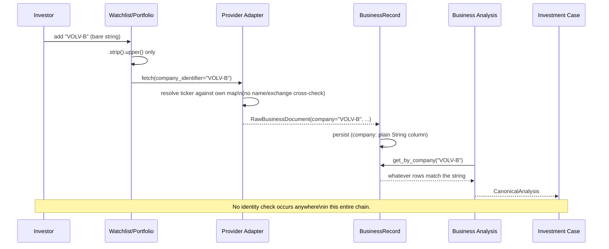
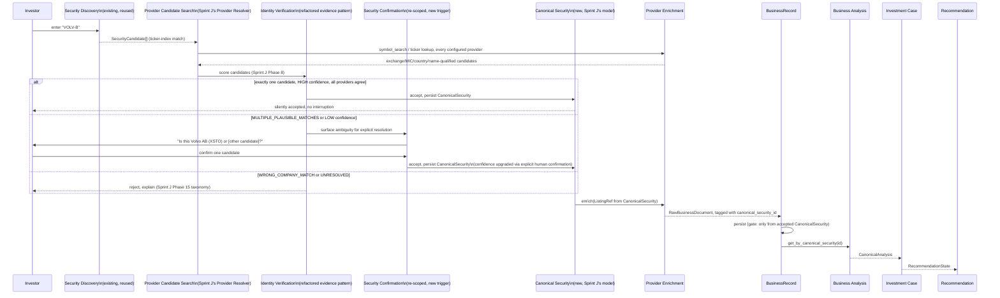
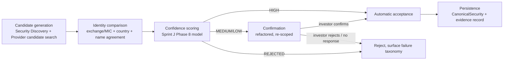

# Identity Integration Architecture

**Sprint scope:** design only. Sprint J found that Atlas already contains
most of the infrastructure a robust identity system needs — the problem is
that it is completely disconnected from the live enrichment pipeline. This
document designs exactly how the two should be integrated, before any
provider integration (Twelve Data or otherwise) is attempted.

---

## Phase 1 — Baseline

- `git status`: clean except the same three pre-existing untracked local
  files present since before Sprint H (`.env`,
  `atlas/business_data_providers/alpha_vantage.py.save`,
  `docs/atlas_beta_sprint1_figma_implementation_review.md`).
- HEAD: `0e3ed81` (Sprint J's commit) — confirmed present in `git log`.
- Provider baseline tests: `.venv/bin/python -m pytest tests/ -k "provider
  or business_data or sec_edgar or alpha_vantage"` → **405 passed, 2
  failed**, identical to Sprints H/I/J's baseline (`test_no_provider_
  imports_added` in two historical sprint-scoped guard tests, unrelated to
  and unaffected by any of these four design/validation sprints — zero
  production code has been touched across any of them).
- No push performed.

---

## Phase 2 — Current Pipeline Mapping

Traced against the actual current source, stage by stage:

| Stage | Inputs | Outputs | Assumptions | Identity state | Ownership |
|---|---|---|---|---|---|
| **User input** (Watchlist add / Portfolio import) | A raw string (`ticker: str`, no exchange/country field on either request shape) | `AlphaWatchlistEntry.ticker` / `AlphaHolding.ticker` — `.strip().upper()` only | The string the investor typed *is* the identity | Uncontrolled — any non-blank string is accepted | `atlas/alpha/watchlist/`, `atlas/alpha/portfolio/` |
| **Case creation** | Nothing ticker-related — `Case.create()` takes no arguments | `Case{id, recorded_at}` | Core's `Case` deliberately carries no identity at all | N/A — identity lives entirely in the Alpha-layer ticker fields, joined by string equality | `atlas/core/domain/case/` |
| **Provider Adapter** (SEC EDGAR / Alpha Vantage) | Bare ticker string | SEC: `RawBusinessDocument` tagged `company=ticker.upper()` via first-match against a flat ticker→CIK map, company title never read. Alpha Vantage: whatever `GLOBAL_QUOTE`/`OVERVIEW` returns for that exact symbol, accepted verbatim | The provider's answer for this exact ticker string is "the company" | Whatever the provider returns, unchecked against anything else | `atlas/business_data_providers/` |
| **BusinessRecord** | `RawBusinessDocument` | Persisted row, `company: str` plain indexed column, no exchange/country/ISIN column at all | `company` field is sufficient identity for all downstream lookups | Bare ticker string, structurally validated only (`MISSING_COMPANY` non-blank check) | `atlas/analysis_engine/business_data/`, `atlas/alpha/business_data_refresh/` |
| **Business Analysis** | `BusinessRecord`s filtered by `get_by_company(ticker)` | `CanonicalAnalysis` (Growth, Capital Allocation, Valuation, Risk, etc.) | The `BusinessRecord`s returned for this ticker all describe the same real company | Inherited, unchecked, from the BusinessRecord layer | `atlas/analysis_engine/` |
| **Investment Case** | `CanonicalAnalysis` + Watchlist/Holding ticker | Composed `InvestmentCase` view | Same as above | Same as above | `atlas/alpha/investment_case/` |
| **Recommendation** | `CanonicalAnalysis` | `RecommendationState` | Same as above | Same as above | `atlas/decision_engine/`, `atlas/analysis_engine/recommendation.py` |

### Sequence diagram — current state



---

## Phase 3 — Existing Identity System

Three packages, mapped precisely from the current source:

### `security_discovery`

Pure, stateless, free-text-or-ticker → `tuple[SecurityCandidate, ...]`.
`discover_security_candidates()` tries an exact ticker match against SEC's
ticker→CIK index first, then falls back to exact canonicalized-title
matching (`canonicalize_company_text` — uppercase, strip punctuation and
legal suffixes). **No persistence at all** — no `table.py`/`repository.py`
exists in this package. API: a single `GET /security-discovery?query=...`.
Never calls OpenFIGI — that is explicitly reserved for verification.

### `security_confirmation`

An append-only event log, **keyed by `decision_id`**, not by ticker, Case,
Watchlist entry, or anything upstream of an actual investment Decision.
`ConfirmedSecuritySelection`/`SecurityConfirmationEvent` carry
`confirmed_ticker`, `confirmed_display_name`, `confirmed_cik`,
`discovery_method`, `discovery_source`. Full lifecycle exists: `confirm()`
(idempotent on the same ticker, `409` on a conflicting one),
`correct()` (atomically revoke-then-reconfirm), `revoke()` (idempotent).
Persisted in its own `security_confirmations` table, no foreign key to
anything (matching the codebase's no-FK convention).

### `security_identity_evidence`

`SecurityVerificationService.verify(decision_id)` — **hard-depends on an
active confirmation already existing** (raises `NoActiveConfirmationError`
otherwise). Calls OpenFIGI (`POST /v3/mapping`, `idType=TICKER`) for the
*confirmed* ticker and classifies the result by comparing the
canonicalized OpenFIGI match name against the canonicalized confirmed
display name. Exactly five outcomes: `verified`, `not_verified`,
`ambiguous`, `provider_unavailable`, `unsupported` (the last one fires when
the confirmation's `discovery_source` isn't in a closed allow-list, today
just `{"sec_company_tickers"}`). A read-only `/history` endpoint (added
Sprint 24) assembles the full confirm/correct/revoke event log with nested
evidence per event. Persisted in its own `security_identity_evidence`
table, no foreign key.

### Where this architecture starts and ends, precisely

It **starts** only once a `decision_id` already exists — i.e., only once an
investor has recorded an actual buy/sell/hold Decision. It **ends** at a
read-only evidence record tied to that one Decision. **It has no concept
of a canonical security identifier independent of a Decision** — the
packages' own docstrings say so explicitly (*"`SecurityIdentity` (future,
unbuilt): would be Atlas's own canonical, resolved identity for a
security. This package is explicitly not that."*). No orchestrating
service calls all three in sequence — each is invoked independently via
its own REST endpoint; the only thing connecting `security_discovery` to
`security_confirmation` today is a human using both APIs separately.

---

## Phase 4 — Integration Gap Analysis

| Gap | Current pipeline | Existing identity system | Consequence |
|---|---|---|---|
| **Scope mismatch** | Ticker enters the system at Watchlist/Portfolio add-time, long before any Decision exists | Confirmation/Evidence only activate once a `decision_id` exists | **The existing system structurally cannot gate enrichment** — by the time a Decision exists, a `BusinessRecord` (possibly for the wrong company, per Sprint H/I) may already have been ingested and an entire Investment Case already composed from it |
| **Provider receives raw ticker** | `fetch(company_identifier=ticker)` | Discovery/confirmation never touch provider adapters at all | The exact unsafe path Sprint H/I proved dangerous (`MC`→Moelis, `EVO`→Evotec) runs with zero interaction with the identity subsystem |
| **BusinessRecord stores provider data directly** | `company: str`, no `confirmation_id`/`evidence_id`/canonical reference | N/A — evidence is Decision-scoped, never BusinessRecord-scoped | A wrong-company `BusinessRecord`, once created, carries no trace that it was ever unverified |
| **Investment Case has no canonical security dependency** | Composed from `BusinessRecord`s matched by bare ticker string | N/A | A Case can be built entirely from data that was never verified by any part of the identity subsystem |
| **Discovery is bypassed** | Watchlist/Portfolio accept any string directly, no call to `discover_security_candidates` | Discovery exists and works, unused | The one piece of infrastructure that could catch a typo or ambiguous name before enrichment starts is simply never invoked |
| **Confirmation is bypassed** | No confirmation step anywhere before enrichment | Confirmation exists, tested, with a real correct/revoke lifecycle | The one piece of infrastructure that could force human resolution of an ambiguous ticker before it corrupts a `BusinessRecord` is never invoked |
| **No canonical identity concept exists anywhere** | `BusinessRecord.company` is the closest thing to an identity key, and it is a bare string | The identity subsystem's own docstrings say a canonical `SecurityIdentity` is "future, unbuilt" | Both sides of the system independently lack the one object Sprint J's design (`CanonicalSecurity`) specifies — this is not a wiring gap alone, it is also a genuine construction gap |

---

## Phase 5 — Canonical Integration Point

Evaluating each candidate location:

| Location | Evaluation |
|---|---|
| **Before provider lookup** | Correct in principle — catches the problem at its root. Requires the identity resolution step to run synchronously (or near-synchronously) at Watchlist-add/Portfolio-import time, before any provider is even called. |
| **After provider lookup, before BusinessRecord creation** | Also viable, and in practice necessary in addition to the above — a provider's *response* (Twelve Data's `symbol_search` candidate list) is itself part of the evidence the resolver needs, so full resolution cannot complete purely "before" any provider call. |
| **Before Case creation** | Too late relative to the collision risk — Sprint H/I's damage (wrong-company `BusinessRecord`s) happens at the provider/BusinessRecord boundary, not at Case composition. Gating only here would let corrupted `BusinessRecord`s persist even if never composed into a Case. |
| **After Security Confirmation** | Too late structurally — Confirmation today only exists once a Decision exists, which is downstream of Case, which is downstream of BusinessRecord. This ordering is backwards relative to when the risk actually manifests. |

**Recommendation: the canonical integration point is a new identity
resolution step that runs across *both* "before provider lookup" (candidate
generation, Phase 6 step 2-3) *and* "after provider lookup, before
BusinessRecord creation" (verification/scoring/acceptance, Phase 6 steps
4-6) — with a **mandatory gate immediately before `BusinessRecord`
creation** as the one non-negotiable checkpoint.**

**Justification:** this is the earliest point at which every piece of
evidence needed (the investor's typed ticker, the provider's own candidate
metadata) actually exists, and the latest point at which rejecting a bad
resolution costs nothing — no `BusinessRecord`, no Case, no analysis has
been built yet. Every gap in Phase 4 traces back to this exact boundary
being unguarded today.

---

## Phase 6 — New End-to-End Flow



Every step is annotated above with whether it is **existing/reused**,
**refactored**, or **new** — this is elaborated fully in Phase 12.

---

## Phase 7 — Provider Responsibilities

| Provider MAY do | Provider MUST NOT do |
|---|---|
| Identity candidate search (return raw candidates: ticker, exchange, MIC, country, name, currency, security type) | Make the canonical identity decision — a provider returning a candidate is evidence, never a verdict |
| Market data (quote, historical prices) | Create or influence Case creation |
| Financial statements | Own or write directly to `BusinessRecord` — a provider produces `RawBusinessDocument`s, which only the BusinessRecord Builder (gated by an accepted `CanonicalSecurity`, Phase 5) may turn into persisted records |
| Company profiles | Perform any recommendation/analysis logic |

This boundary is a direct, minimal extension of the existing
`BusinessDataProvider`/`HistoricalMarketDataProvider`/`CompanyProfileProvider`
Protocol family (Sprint G/J) — providers keep exactly the responsibilities
they have today; what changes is that their *output* now feeds a Resolver
rather than writing straight to a `BusinessRecord`.

---

## Phase 8 — Canonical Security Responsibilities

Directly inherited from Sprint J's Phase 4/13 design, restated in terms of
what it *owns* within this integration:

- **Identity ownership** — the single, stable `atlas_id` that everything
  downstream references, replacing bare-ticker string joins.
- **Provider mapping** — which provider-specific symbol/CIK/OpenFIGI-FIGI
  corresponds to this security, so a future provider swap needs no change
  to anything downstream of `CanonicalSecurity` (Phase 16).
- **Native listing / ADR relationships** — the `listings: tuple[ListingRef]`
  field (Sprint J Phase 10), so TSM's NYSE ADR and a hypothetical native
  TWSE listing are related, never conflated.
- **Identifier management** — ISIN/FIGI/CUSIP/CIK, populated
  opportunistically as they become available (Sprint J Phase 4), never
  required for initial acceptance.
- **Provider provenance** — per Sprint J Phase 11's `FieldProvenance` model,
  which provider supplied which fact, at what confidence, with what
  corroborating/disagreeing providers.
- **Accepted provider mappings** — the record of which candidate was
  accepted and why (Sprint J's confidence model), auditable after the
  fact.

**Canonical Security does NOT own**: market data, financial statement
values, analysis results, or recommendation logic — it is purely an
identity record, never a data cache.

---

## Phase 9 — BusinessRecord Responsibilities (future contract)

| Field | Today | Future |
|---|---|---|
| Ticker | `company: str`, sole identity key | Retained, but demoted to a display/audit field, never the lookup key |
| Provider symbol | Not tracked separately from `company` | New field — the exact provider-native symbol used for this fetch (e.g., Twelve Data's `VOLV.B`), for audit/re-fetch purposes |
| **Canonical Security ID** | Does not exist | **New, required field** — every `BusinessRecord` must reference an accepted `CanonicalSecurity.atlas_id`; this is the field that replaces bare-ticker joins across Watchlist/Portfolio/BusinessRecord |
| Provider ID | Exists (`provider_id`) | Unchanged |
| Identity evidence | Does not exist | New, optional field — a reference to the specific resolution/verification event that justified accepting this record's canonical security (links to the refactored evidence pattern, Phase 11) |
| Provider provenance | Document-level only (`Provenance`) | Extended to per-field granularity per Sprint J Phase 11 |

**The one binding rule, restated from Sprint J Phase 16, rule 6: a
`BusinessRecord` may only be created from an accepted `CanonicalSecurity`.**
This is the single structural change this integration requires relative to
today.

---

## Phase 10 — Provider Adapter Changes

**Current:**
```
ticker: str  →  Provider.fetch(company_identifier=ticker)  →  RawBusinessDocument
```

**Future:**
```
CanonicalSecurity  →  select ListingRef for target provider  →  provider_mapping (provider-native symbol)  →  Provider.fetch(company_identifier=provider_mapping.symbol)  →  RawBusinessDocument tagged with canonical_security_id
```

**Required interface changes (not implemented this sprint):**
1. Providers additionally implement (or the Resolver wraps them with) a
   **candidate-search capability** distinct from `fetch()` — returning raw
   identity candidates (ticker, exchange, MIC, country, name, security
   type) rather than business documents. For providers exposing a
   dedicated identity endpoint (Twelve Data's `symbol_search`), this is a
   thin new method; for SEC EDGAR, this is the existing ticker→CIK
   resolution, exposed as a candidate rather than consumed silently
   in-line.
2. `fetch()`/`fetch_historical_snapshots()`/`fetch_company_profile()`
   signatures gain a `provider_mapping` (or continue accepting
   `company_identifier`, now populated by the Resolver from a
   `CanonicalSecurity`'s `ListingRef` rather than a raw user string) — this
   is additive, not a breaking change to the existing Protocol shape.
3. No change to the existing `BusinessDataProvider`/
   `HistoricalMarketDataProvider`/`CompanyProfileProvider` Protocol
   contracts themselves — the fan-out orchestration pattern in
   `refresh_company_data` is preserved unchanged.

---

## Phase 11 — Identity Verification Pipeline



This is a direct generalization of the existing `security_identity_
evidence` service's own internal shape (candidate → provider verification
→ classify → persist) — the *pattern* is proven and tested; what changes
is the trigger (runs automatically during enrichment, not only on-demand
per Decision) and the scope key (a resolution-in-progress identifier, not
`decision_id` — see Phase 12).

---

## Phase 12 — Existing Code Reuse

| Component | Disposition | Reasoning |
|---|---|---|
| `security_discovery` (candidate generation, ticker/title matching) | **Reuse as-is** | Already stateless, already decision-independent, exactly the shape Phase 6 step 1 needs — no rework required |
| `openfigi_adapter.py` (raw OpenFIGI call + match parsing) | **Reuse as-is** | Pure, ticker-in/matches-out, carries no `decision_id` coupling itself — the coupling lives one layer up, in `SecurityVerificationService` |
| `canonicalize_company_text` | **Reuse as-is** | Already the exact name-agreement primitive Sprint J's Phase 5/8 hierarchy calls for |
| `security_identity_evidence`'s `_classify()` logic (verified/not_verified/ambiguous/provider_unavailable/unsupported) | **Refactor** | The classification logic itself is sound and should become the identity-comparison/confidence step (Phase 11); it needs decoupling from its current hard dependency on an existing `decision_id`-scoped confirmation |
| `security_confirmation`'s event-sourcing pattern (append-only confirm/correct/revoke, idempotency, ordering-safety via `_next_recorded_at`) | **Refactor** | The *pattern* is exactly right for Phase 6's new confirmation step and should be lifted, but re-scoped from `decision_id` to a new resolution-scoped key (Phase 13) |
| `security_confirmation`/`security_identity_evidence`'s existing `decision_id`-scoped tables and API routes | **Leave unchanged** | These continue to serve their original, still-valid purpose — an investor confirming what security a *specific recorded Decision* concerns, auditable independently of when/how the underlying Case was first enriched. This is not superseded, it becomes an optional second checkpoint (Phase 14) |
| Provider adapters (SEC EDGAR, Alpha Vantage) | **Refactor** (additive) | Per Phase 10 — new candidate-search capability added, existing `fetch()` contracts unchanged |
| `BusinessRecord` model/table | **Refactor** | New required `canonical_security_id` field, new optional `provider_mapping`/`identity_evidence` fields — additive schema change, not a replacement |
| `atlas/core/domain/case/entity.py` (`Case`) | **Leave unchanged** | Case's deliberate lack of identity is still correct — identity belongs to `CanonicalSecurity`, referenced transitively via `BusinessRecord`, not duplicated onto `Case` itself |

---

## Phase 13 — Migration Strategy

1. **Introduce the `CanonicalSecurity` dependency** — build the aggregate
   and its store (Sprint J Phase 19 step 1), with zero call sites yet.
2. **Redirect provider lookup** — implement the candidate-search capability
   (Phase 10) and the Resolver/Verification pipeline (Phase 11), operating
   in shadow mode (computed and logged, not yet gating anything) so its
   real-world behavior against Atlas's actual Watchlist/Portfolio universe
   can be observed before it blocks anything.
3. **Require confirmation for ambiguous cases** — wire the refactored
   confirmation step (Phase 12) to actually interrupt the flow for
   `MEDIUM`/`LOW`-confidence resolutions, while `HIGH`-confidence
   resolutions continue silently (preserving today's frictionless
   experience for the 6/19 fully-supported US companies from Sprint H/I).
4. **Update BusinessRecord creation** — add the `canonical_security_id`
   gate (Phase 5/9) as a hard requirement for *new* records only.
5. **Deprecate the raw ticker flow** — once the above has run against real
   traffic without regressions, remove the direct
   ticker-string-to-provider path entirely, so there is no remaining way
   to bypass resolution.

**Every step preserves Alpha functionality**: steps 1-3 are purely
additive (new code paths, nothing removed or gated yet); step 4 only
applies to newly-created records, never retroactively (see Phase 14); step
5 only happens once step 4 has been running safely — this sequencing
directly avoids ever having a moment where enrichment stops working while
the new system is unproven.

---

## Phase 14 — Backward Compatibility

| Existing data | Treatment |
|---|---|
| Existing Cases | Unaffected — `Case` never carried identity, nothing to migrate at this layer |
| Existing Watchlists / Holdings | Ticker fields remain as-is; **lazily** backfilled — the first time a `refresh_company_data` runs for an existing ticker after migration, it goes through the new resolution pipeline and the resulting `CanonicalSecurity` gets attached retroactively, rather than a bulk migration job touching every row at once |
| Existing BusinessRecords | Remain valid and queryable by their existing `company` string field — **not** retroactively rejected or deleted for lacking a `canonical_security_id`. New records require it (Phase 13 step 4); old records are grandfathered, distinguishable by the field's presence/absence |
| Historical Decisions | Fully unaffected — the existing `security_confirmation`/`security_identity_evidence` subsystem (Phase 12: left unchanged) continues to serve exactly the Decisions it already covers |

**Migration mode: lazy + background, never bulk-automatic and never purely
manual.** A one-time bulk resolution of Atlas's entire existing ticker
universe would re-introduce exactly the risk this design exists to prevent
(resolving many tickers unattended, with no chance to catch
`MULTIPLE_PLAUSIBLE_MATCHES` cases as they're found) — lazy, on-next-touch
resolution keeps volume low and each resolution individually reviewable
where confidence warrants it.

---

## Phase 15 — Failure Handling

| Failure | Behavior |
|---|---|
| Unknown ticker | `UNRESOLVED` (Sprint J Phase 7) — surfaced to the investor as "we couldn't find this security," never silently ignored |
| Ambiguous ticker | `MULTIPLE_PLAUSIBLE_MATCHES` → routed to the refactored confirmation step (Phase 6); enrichment blocked until resolved |
| Wrong company (detected via disagreement) | `WRONG_COMPANY_MATCH` → rejected outright, per Sprint J Phase 12's collision rules — never silently accepted even if only one provider was queried |
| Multiple providers disagree | Per Sprint J Phase 9 — automatic rejection unless a clear exchange/MIC-qualified candidate outranks an unqualified one (e.g., Twelve Data vs. SEC EDGAR's flat map); three-way disagreement with no majority → manual review, never auto-resolved by count |
| No provider succeeds | `UNRESOLVED`, same as unknown ticker — this is the honest, already-precedented outcome (matches the analysis engine's existing `INSUFFICIENT_INPUT` pattern) |
| Identity expires (a resolution's corroborating evidence ages out — e.g., a ticker gets reassigned to a different company later) | Not resolved by this sprint's design in full — flagged as a Remaining Unknown (Phase 18); the `last_confirmed_at` field on `CanonicalSecurity` (Sprint J Phase 4) is the hook a future re-verification policy would use |
| Provider mapping changes (a provider changes its own symbol scheme) | Handled at the `ListingRef` level (Sprint J Phase 4) — a `ListingRef` records the provider-native symbol used *at resolution time*; a changed provider symbol requires a fresh resolution, not a silent re-use of a stale mapping |
| Rejected confirmation (investor explicitly declines a proposed candidate) | Treated the same as `UNRESOLVED` for that ticker — no `BusinessRecord`/Case may be created from it; the investor's rejection itself should be persisted (extending the existing append-only event pattern) so a later attempt doesn't silently re-propose the same rejected candidate |

---

## Phase 16 — Provider Independence

The architecture keeps providers behind exactly the same seam Sprint G/J
already established: `BusinessDataProvider`/`HistoricalMarketDataProvider`/
`CompanyProfileProvider`. Adding candidate-search (Phase 10) is additive to
that same Protocol family, not a new coupling mechanism. Swapping Twelve
Data for a different vendor requires:

- A new adapter implementing the same Protocol + candidate-search
  capability.
- Its own `provider_mapping` entries inside existing `ListingRef`s (no
  schema change — `ListingRef` already carries an arbitrary
  `provider_symbol` field per Sprint J Phase 4).

**No change to `CanonicalSecurity`, the Resolver, the Conflict Engine, the
confirmation pipeline, `BusinessRecord`'s contract, or anything downstream**
— exactly the "only a new adapter and provider mapping" bar the brief
sets. This was true of the original provider architecture (Sprint G's own
finding that the Protocol family is "already proven swappable") and
nothing in this integration design weakens that property; it strengthens
it, since identity resolution now happens once, above the provider layer,
rather than being re-implemented per adapter.

---

## Phase 17 — Integration Test Plan

| Case | What it validates |
|---|---|
| AAPL | The `HIGH`-confidence, silent-acceptance path — must remain frictionless, zero behavior change perceptible to the investor |
| VOLV-B | Single-provider (Twelve Data only, SEC returns nothing), `MEDIUM`-confidence acceptance without requiring confirmation, since there is no disagreement to resolve, only an absence |
| MC | The core regression case — must resolve to `MULTIPLE_PLAUSIBLE_MATCHES` and require explicit confirmation, never silently pick either LVMH or Moelis & Co |
| EVO | Same as MC — `MULTIPLE_PLAUSIBLE_MATCHES` from Twelve Data's own candidate list, `WRONG_COMPANY_MATCH` from SEC EDGAR alone, must never resolve automatically |
| TSM | `EXACT_ADR_MATCH` classification must be preserved distinctly from `EXACT_NATIVE_MATCH` — a test asserting the resulting `CanonicalSecurity.listings` contains a `relationship=ADR` entry, not silently merged with a hypothetical native listing |
| ASML | Identity resolves cleanly (`EXACT_NATIVE_MATCH`) even though the *statement* stage still fails (20-F gap) — this test validates that identity resolution and data-completeness are correctly treated as separate concerns, not conflated into one failure |
| ADR/native conflicts | A synthetic case where two providers return, respectively, a native listing and an ADR for the same underlying company — must produce two linked `ListingRef`s under one `CanonicalSecurity`, never one merged record and never two unrelated `CanonicalSecurity` records |
| Wrong-company collisions | MC/EVO again, explicitly asserting the *rejected* candidate (Moelis & Co, Evotec SE) is retained in provenance/audit but never referenced by any `BusinessRecord` |
| Provider disagreement | A synthetic three-provider disagreement case, asserting manual review is triggered rather than any majority-vote auto-resolution |
| Rejected identities | An investor explicitly declining a proposed candidate — asserting no `BusinessRecord` is created and the rejection is durably recorded, not silently forgotten on retry |

The tests should exercise the **entire pipeline** (Discovery → Resolver →
Verification → Confirmation → CanonicalSecurity → Provider enrichment →
BusinessRecord → Analysis → Case), not each package in isolation — this is
the one class of test that does not exist anywhere in the codebase today,
since the identity subsystem and the enrichment pipeline have never been
exercised together.

---

## Phase 18 — Architecture Validation

| Prior finding | Prevented by this architecture? | Explanation |
|---|---|---|
| Sprint H: SEC EDGAR silently resolves `MC`→Moelis, `EVO`→Evotec | **Yes** | Both are `WRONG_COMPANY_MATCH`/discarded-candidate cases under Phase 5's exchange/MIC-required rule — SEC's flat, exchange-less match can never alone reach `HIGH` confidence |
| Sprint H: Alpha Vantage's 25/day quota blocks enrichment | **No — out of scope by design** | This is an operational rate-limit problem, not an identity problem; nothing in this architecture changes provider quota behavior, and it was never claimed to |
| Sprint I: Twelve Data's own `symbol_search` returns Moelis & Co and Evotec SE as candidates too | **Yes** | This is precisely why the design requires *filtering and scoring* candidates (Phase 6 steps 2-4) rather than trusting any single provider's top-ranked or only result — the failure mode this finding proved (a rich provider's own ambiguity, unresolved) is exactly what the Resolver/Verification/Confirmation chain exists to catch |
| Sprint I: latent currency-mixing risk (ADR quote + native-listing statement) | **Partially** | The `ListingRef`/`relationship` model (Phase 8, Sprint J Phase 10) prevents *silently* merging an ADR and a native listing's data, which removes the primary vector for this risk; full currency-safety enforcement (Sprint J Phase 14) is a separate, not-yet-implemented mechanism this architecture depends on but does not itself complete |
| Sprint J: no canonical identity model exists | **Yes, this document's entire purpose** | `CanonicalSecurity` (Phase 8) is exactly that model, now wired into the pipeline rather than sitting as an unused specification |
| Sprint J: the identity-verification subsystem is disconnected from the live pipeline | **Yes, this document's entire purpose** | Phase 12's reuse/refactor plan and Phase 13's migration sequence are the concrete answer to this exact finding |

**Every previously discovered failure with an identity-shaped root cause is
addressed. The one finding correctly left unaddressed (Alpha Vantage's
rate limit) is an operational, not identity, problem, and was never in
scope for this design.**

---

## Phase 19 — Final Architecture

```mermaid
flowchart TD
    U[User] --> D[Discovery]
    D --> I[Identity\nResolver + Verification]
    I -->|ambiguous / low confidence| C[Confirmation]
    C --> CS[Canonical Security]
    I -->|high confidence| CS
    CS --> PA[Provider Adapter]
    PA --> BR[BusinessRecord]
    BR --> AN[Analysis]
    AN --> IC[Investment Case]
    IC --> REC[Recommendation]

    style CS fill:#1f3a5f,stroke:#4a90d9
    style I fill:#1f3a5f,stroke:#4a90d9
```



This is the long-term reference architecture. **Identity (Discovery →
Resolver/Verification → Confirmation → Canonical Security)** is a single,
cohesive stage that sits entirely upstream of everything Atlas already
does well (Provider Adapter → BusinessRecord → Analysis → Investment Case
→ Recommendation, all unchanged in internal logic). No component
downstream of Canonical Security needs to know how identity was resolved —
only that it was, and to what confidence, per the provenance model (Sprint
J Phase 11).

---

## Phase 20 — Final Recommendation

**YES, WITH SAFEGUARDS.**

Evidence from Sprints H, I, and J:

- Sprint H and I together prove the *specific* risk (silent wrong-company
  data) is real, live, and reproducible on **both** of the providers Atlas
  has ever tested against this matter — SEC EDGAR (already integrated) and
  Twelve Data (the integration candidate). This means the risk is not
  "introduced by" Twelve Data; it already exists in production today via
  SEC EDGAR.
- Sprint J proved the fix does not require new external infrastructure —
  Atlas already has working discovery, confirmation, and OpenFIGI
  verification code, just disconnected from the live path.
- This sprint's migration plan (Phase 13) is explicitly staged so that the
  **safeguards can be built and proven in shadow mode before Twelve Data
  is integrated**, not as a blocking prerequisite that must fully ship
  first. Specifically: Twelve Data integration can proceed in parallel
  with Phase 13 steps 1-2 (introducing `CanonicalSecurity` and running the
  Resolver in shadow/logging mode against both providers), **provided**
  step 3 (mandatory confirmation for ambiguous cases) and step 4
  (the `BusinessRecord` canonical-security gate) are in place **before**
  Twelve Data's results are ever allowed to write a `BusinessRecord`
  unattended.

This is not a `NO` because withholding Twelve Data entirely, while SEC
EDGAR's identical unguarded risk remains live in production, would not
actually reduce Atlas's real exposure — it would just leave the existing
vulnerability unaddressed while waiting. It is not an unconditional `YES`
because Sprint I directly showed Twelve Data's own candidate lists carry
the same collision risk SEC EDGAR does, and integrating it without at
least the Phase 13 step-3/4 gates would be integrating a second unguarded
data source rather than fixing the first.

---

## Final Deliverables Index

1. This document — `docs/identity_integration_architecture.md`.
2. Current pipeline diagram — Phase 2.
3. Identity architecture diagram — Phase 3 (described precisely; the
   existing subsystem's own file/table structure is the diagram, given how
   disconnected it is from anything else worth drawing arrows to).
4. Gap analysis — Phase 4.
5. Integration architecture — Phase 6, Phase 19.
6. Provider responsibility model — Phase 7.
7. Canonical Security responsibility model — Phase 8.
8. BusinessRecord contract — Phase 9.
9. Provider adapter contract — Phase 10.
10. Migration strategy — Phase 13.
11. Backward compatibility plan — Phase 14.
12. Failure-handling specification — Phase 15.
13. Integration test plan — Phase 17.
14. Final architecture diagram — Phase 19.
15. Final recommendation — Phase 20: **YES, WITH SAFEGUARDS.**
16. Commit hash: recorded in this sprint's commit message (see repository
    history — embedding a hash inside the file it describes would require
    amending the same commit that creates it).
